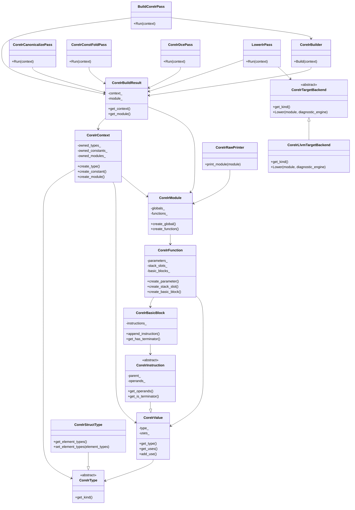

# Class Relationships

## Scope

This document describes the current class relationships in the SysyCC project.
It focuses on the active main path used by the executable.

The backend was recently refactored from one monolithic `IRGenPass` plus an
internal `CoreIrPipeline/CoreIrPassManager` into explicit top-level backend
passes. The top relationship graph below reflects the current model; some
historical narrative later in this document may still refer to the older
staged names.

## Main Relationship Graph

```mermaid
classDiagram
    class Cli {
        +Run(argc, argv)
        +set_compiler_option(option)
    }

    class Complier {
        -ComplierOption option_
        -CompilerContext context_
        -PassManager pass_manager_
        -sync_context_from_option()
        +validate_dialect_configuration()
        +Run()
    }

    class ComplierOption {
        -input_file_
        -output_file_
        -include_directories_
        -system_include_directories_
        -dump_tokens_
        -dump_parse_
        -dump_ast_
        -dump_ir_
        -stop_after_stage_
        -enable_gnu_dialect_
        -enable_clang_dialect_
        -enable_builtin_type_extension_pack_
    }

    class CompilerContext {
        -input_file_
        -preprocessed_file_path_
        -include_directories_
        -system_include_directories_
        -source_manager_
        -source_location_service_
        -dialect_manager_
        -preprocessed_line_map_
        -tokens_
        -stop_after_stage_
        -parse_tree_root_
        -ast_root_
        -ast_complete_
        -semantic_model_
        -ir_result_
        -diagnostic_engine_
        -token_dump_file_path_
        -parse_dump_file_path_
        -ast_dump_file_path_
        -ir_dump_file_path_
        +get_source_location_service()
        +get_dialect_manager()
    }

    class PassManager {
        -passes_
        +AddPass(pass)
        +Run(context)
    }

    class Pass {
        <<abstract>>
        +Kind()
        +Name()
        +Run(context)
    }

    class LexerPass {
    }

    class ParserPass {
    }

    class ParserFeatureValidator {
        +validate(parse_tree_root, feature_registry, error_info)
    }

    class AttributeParser {
        +parse_gnu_attribute_specifier_seq(node, attachment_site)
    }

    class ParserErrorInfo {
        -message_
        -token_text_
        -source_span_
        +get_message()
        +get_token_text()
        +get_source_span()
    }

    class AstPass {
    }

    class AstFeatureValidator {
        +validate(ast_root, feature_registry, error_info)
    }

    class SemanticPass {
    }

    class BuildCoreIrPass {
    }

    class CoreIrCanonicalizePass {
    }

    class CoreIrConstFoldPass {
    }

    class CoreIrDcePass {
    }

    class LowerIrPass {
    }

    class CoreIrBuilder {
        +Build(context)
    }

    class CoreIrTargetBackend {
        <<abstract>>
        +Lower(build_result, kind, diagnostic_engine)
    }

    class CoreIrLlvmTargetBackend {
    }

    class Diagnostic {
        -level_
        -stage_
        -message_
        -source_span_
        +get_level()
        +get_stage()
        +get_message()
        +get_source_span()
    }

    class DiagnosticEngine {
        -diagnostics_
        +get_diagnostics()
        +clear()
        +has_error()
        +add_diagnostic()
        +add_error()
        +add_warning()
        +add_note()
    }

    class DiagnosticFormatter {
        +format_source_span(source_span)
        +get_cli_format_policy(diagnostic)
        +format_diagnostic_for_cli(diagnostic)
        +print_diagnostics(os, diagnostic_engine)
    }

    class IRResult {
        -kind_
        -text_
        +get_kind()
        +get_text()
    }

    class IRValue {
        +text
        +type
    }

    class IRFunctionParameter {
        +name
        +type
    }

    class IRFunctionAttribute {
        <<enum>>
        AlwaysInline
    }

    class IRBackend {
        <<abstract>>
        +get_kind()
        +begin_module()
        +end_module()
        +declare_global(name, type, is_internal_linkage)
        +define_global(name, type, initializer_text, is_internal_linkage)
        +begin_function(name, return_type, parameters, attributes, is_internal_linkage)
        +end_function()
        +create_label(hint)
        +emit_label(label)
        +emit_branch(target_label)
        +emit_cond_branch(condition, true_label, false_label)
        +emit_integer_literal(value)
        +emit_floating_literal(value_text, type)
        +emit_string_literal_address(value_text, type)
        +emit_alloca(name, type)
        +emit_store(address, value)
        +emit_load(address, type)
        +emit_binary(op, lhs, rhs, result_type)
        +emit_cast(value, target_type)
        +emit_call(callee, arguments, return_type)
        +emit_return(value)
        +emit_return_void()
        +get_output_text()
    }

    class IRBuilder {
        -backend_
        +Build(context)
    }

    class GnuFunctionAttributeLoweringHandler {
        +lower_function_attributes(semantic_attributes)
    }

    class ExtendedBuiltinTypeSemanticHandler {
        +is_extended_scalar_builtin_name(name)
        +get_usual_arithmetic_conversion_type(lhs, rhs, semantic_model)
    }

    class LlvmIrBackend {
    }

    class AggregateLayoutInfo {
        +elements
        +field_layouts
        +size
        +alignment
    }

    class IRContext {
        -next_temp_id_
        -next_label_id_
        +reset()
        +allocate_temp_id()
        +allocate_label_id()
        +get_temp_name()
        +get_label_name()
    }

    class SymbolValueMap {
        -values_
        +clear()
        +bind_value(node, value)
        +get_value(node)
    }

    class LexerState {
        -source_mapping_view_
        -keyword_registry_
        -line_
        -column_
        -token_line_begin_
        -token_column_begin_
        -token_line_end_
        -token_column_end_
        -emit_parse_nodes_
        +reset()
        +set_source_mapping_view()
        +get_source_mapping_view()
        +set_keyword_registry()
        +get_keyword_registry()
        +update_position()
        +get_token_line_begin()
        +get_token_column_begin()
        +get_token_line_end()
        +get_token_column_end()
        +get_token_begin_physical_position()
        +get_token_end_physical_position()
        +get_token_begin_logical_position()
        +get_token_end_logical_position()
        +get_token_begin_position()
        +get_token_end_position()
        +get_emit_parse_nodes()
        +set_emit_parse_nodes()
    }

    class PreprocessPass {
    }

    class PreprocessSession {
    }

    class PreprocessContext {
        +clear()
        +get_compiler_context()
        +get_runtime()
        +get_macro_table()
        +get_conditional_stack()
        +get_source_mapper()
        +get_include_directories()
        +get_system_include_directories()
        +get_input_file()
    }

    class PreprocessRuntime {
        -output_lines_
        -output_line_map_
        -pragma_once_files_
        -processed_files_
        -in_block_comment_
    }

    class SourceLineMap {
        -line_positions_
        +clear()
        +empty()
        +get_line_count()
        +add_line_position(position)
        +get_line_position(line)
        +get_line_positions()
    }

    class SourceLocationService {
        -source_manager_
        -preprocessed_line_map_
        +get_source_manager()
        +get_preprocessed_line_map()
        +build_source_mapping_view(physical_file_path)
    }

    class SourceMappingView {
        -physical_file_
        -line_map_
        +has_logical_mapping()
        +get_physical_file()
        +get_line_map()
        +get_physical_position(physical_line, column)
        +get_physical_span(line_begin, col_begin, line_end, col_end)
        +get_logical_position(physical_line, column)
        +get_logical_span(line_begin, col_begin, line_end, col_end)
    }

    class DialectManager {
        -dialects_
        -preprocess_feature_registry_
        -preprocess_probe_handler_registry_
        -preprocess_directive_handler_registry_
        -lexer_keyword_registry_
        -parser_feature_registry_
        -ast_feature_registry_
        -semantic_feature_registry_
        -attribute_semantic_handler_registry_
        -builtin_type_semantic_handler_registry_
        -ir_extension_lowering_registry_
        -ir_feature_registry_
        -registration_errors_
        +register_dialect(dialect)
        +get_dialects()
        +get_dialect_names()
        +get_preprocess_feature_registry()
        +get_preprocess_probe_handler_registry()
        +get_preprocess_directive_handler_registry()
        +get_lexer_keyword_registry()
        +get_parser_feature_registry()
        +get_ast_feature_registry()
        +get_semantic_feature_registry()
        +get_attribute_semantic_handler_registry()
        +get_builtin_type_semantic_handler_registry()
        +get_ir_extension_lowering_registry()
        +get_ir_feature_registry()
        +get_registration_errors()
    }

    class FrontendDialect {
        <<abstract>>
        +get_name()
        +contribute_preprocess_features(registry)
        +contribute_preprocess_probe_handlers(registry)
        +contribute_preprocess_directive_handlers(registry)
        +contribute_lexer_keywords(registry)
        +contribute_parser_features(registry)
        +contribute_ast_features(registry)
        +contribute_semantic_features(registry)
        +contribute_attribute_semantic_handlers(registry)
        +contribute_builtin_type_semantic_handlers(registry)
        +contribute_ir_extension_lowering_handlers(registry)
        +contribute_ir_features(registry)
    }

    class PreprocessFeatureRegistry {
        -features_
        +add_feature(feature)
        +has_feature(feature)
        +get_features()
    }

    class PreprocessProbeHandlerRegistry {
        -owner_names_
        -registration_errors_
        +add_handler(handler_kind, owner_name)
        +has_handler(handler_kind)
        +get_owner_name(handler_kind)
        +get_registration_errors()
    }

    class PreprocessDirectiveHandlerRegistry {
        -owner_names_
        -registration_errors_
        +add_handler(handler_kind, owner_name)
        +has_handler(handler_kind)
        +get_owner_name(handler_kind)
        +get_registration_errors()
    }

    class LexerKeywordRegistry {
        -keywords_
        -conflicts_
        +add_keyword(text, kind)
        +has_keyword(text)
        +get_keyword_kind(text)
        +get_keywords()
        +get_conflicts()
    }

    class AttributeSemanticHandlerRegistry {
        -owner_names_
        -registration_errors_
        +add_handler(handler_kind, owner_name)
        +has_handler(handler_kind)
        +get_owner_name(handler_kind)
        +get_registration_errors()
    }

    class BuiltinTypeSemanticHandlerRegistry {
        -owner_names_
        -registration_errors_
        +add_handler(handler_kind, owner_name)
        +has_handler(handler_kind)
        +get_owner_name(handler_kind)
        +get_registration_errors()
    }

    class IrExtensionLoweringRegistry {
        -owner_names_
        -registration_errors_
        +add_handler(handler_kind, owner_name)
        +has_handler(handler_kind)
        +get_owner_name(handler_kind)
        +get_registration_errors()
    }

    class ParserFeatureRegistry {
        -features_
        +add_feature(feature)
        +has_feature(feature)
        +get_features()
    }

    class AstFeatureRegistry {
        -features_
        +add_feature(feature)
        +has_feature(feature)
        +get_features()
    }

    class SemanticFeatureRegistry {
        -features_
        +add_feature(feature)
        +has_feature(feature)
        +get_features()
    }

    class IrFeatureRegistry {
        -features_
        +add_feature(feature)
        +has_feature(feature)
        +get_features()
    }

    class C99Dialect {
    }

    class GnuDialect {
    }

    class ClangDialect {
    }

    class BuiltinTypeExtensionPack {
    }

    class ParseTreeNode {
        +label
        +source_span
        +children
    }

    class SourceMapper {
        +clear()
        +push_file(file_path, include_position)
        +pop_file()
        +has_file_in_stack(file_path)
        +get_current_physical_file_path()
        +apply_line_directive(physical_line, logical_line, logical_file_path)
        +get_physical_position(physical_line, column)
        +get_physical_span(line_begin, col_begin, line_end, col_end)
        +get_logical_position(physical_line, column)
        +get_logical_span(line_begin, col_begin, line_end, col_end)
        +get_include_trace()
    }

    class ConstantExpressionEvaluator {
        +evaluate(expression, macro_table, current_file_path, include_directories, system_include_directories, value)
    }

    class MacroDefinition {
    }

    class MacroTable {
    }

    class MacroExpander {
    }

    class ConditionalStack {
    }

    class BuiltinProbeEvaluator {
        +try_evaluate(expression, index, macro_table, current_file_path, include_directories, system_include_directories, dialect_manager, value, handled)
    }

    class NonStandardExtensionManager {
        +try_evaluate(expression, index, registry, value, handled)
    }

    class ClangExtensionProvider {
        +try_evaluate(expression, index, value, handled)
    }

    class GnuExtensionProvider {
        +try_evaluate(expression, index, value, handled)
    }

    class DirectiveExecutor {
        +execute(line, line_number, directive, current_file_path, preprocess_file_callback)
    }

    class DirectiveParser {
    }

    class IncludeResolver {
        +resolve_include()
    }

    class FileLoader {
    }

    class Token {
        -TokenKind kind_
        -string text_
        -SourceSpan source_span_
        +get_kind()
        +get_text()
        +get_source_span()
        +get_category()
        +get_kind_name()
    }

    class SourceSpan {
        -begin_
        -end_
    }

    class SourceFile {
        -path_
    }

    class SourceManager {
        -source_files_
        +get_source_file(path)
    }

    class SourcePosition {
        -file_
        -line_
        -column_
        +get_file()
        +get_line()
        +get_column()
    }

    class ParseTreeNode {
        +string label
        +children
    }

    class AstNode {
        -AstKind kind_
        -SourceSpan source_span_
        +get_kind()
        +get_source_span()
    }

    class SemanticModel {
        -success_
        -diagnostics_
        -node_types_
        -symbol_bindings_
        -integer_constant_values_
        -variable_infos_
        +get_success()
        +get_diagnostics()
        +get_node_type()
        +get_symbol_binding()
        +get_integer_constant_value()
        +get_variable_info()
    }

    class VariableSemanticInfo {
        -is_global_storage_
        -has_external_linkage_
        -has_internal_linkage_
        -has_tentative_definition_
        -has_initialized_definition_
        +get_is_global_storage()
        +get_has_external_linkage()
        +get_has_internal_linkage()
        +get_has_tentative_definition()
        +get_has_initialized_definition()
    }

    class SemanticDiagnostic {
        -severity_
        -message_
        -source_span_
        +get_severity()
        +get_message()
        +get_source_span()
    }

    class SemanticSymbol {
        -kind_
        -name_
        -type_
        -decl_node_
        +get_kind()
        +get_name()
        +get_type()
        +get_decl_node()
    }

    class SemanticType {
        -kind_
        +get_kind()
    }

    class SemanticFieldInfo {
        -name_
        -type_
        +get_name()
        +get_type()
    }

    class SemanticAnalyzer {
        +Analyze(translation_unit, semantic_context, scope_stack)
    }

    class DeclAnalyzer {
        +analyze_decl(decl, semantic_context, scope_stack)
    }

    class StmtAnalyzer {
        +analyze_stmt(stmt, semantic_context, scope_stack)
    }

    class ExprAnalyzer {
        +analyze_expr(expr, semantic_context, scope_stack)
    }

    class TypeResolver {
        +resolve_type(type_node, semantic_context)
        +apply_array_dimensions(base_type, dimensions, semantic_context)
    }

    class ConversionChecker {
        +is_assignable_type(target, value)
        +is_scalar_type(type)
        +is_integer_like_type(type)
        +get_usual_arithmetic_conversion_type(lhs, rhs, semantic_model)
    }

    class IntegerConversionService {
        +get_integer_type_info(type)
        +get_floating_type_rank(type)
        +get_integer_promotion_type(type, semantic_model)
        +get_common_integer_type(lhs, rhs, semantic_model)
        +get_usual_arithmetic_conversion_type(lhs, rhs, semantic_model)
        +get_integer_conversion_plan(source_type, target_type)
    }

    class ConstantEvaluator {
        +get_integer_constant_value(node, semantic_context)
        +is_integer_constant_expr(expr, semantic_context, conversion_checker)
    }

    class SemanticContext {
        -compiler_context_
        -semantic_model_
        -current_function_
        -current_return_type_
        -loop_depth_
        -switch_depth_
        +get_compiler_context()
        +get_semantic_model()
        +get_loop_depth()
        +get_switch_depth()
    }

    class ScopeStack {
        -scopes_
        +push_scope()
        +pop_scope()
        +define(symbol)
        +lookup(name)
    }

    class BuiltinSymbols {
        +install(semantic_model, scope_stack)
    }

    class TranslationUnit {
        -top_level_decls_
        +get_top_level_decls()
    }

    class FunctionDecl {
        -name_
        -return_type_
        -parameters_
        -is_static_
        -is_variadic_
        -attributes_
        -asm_label_
        -body_
        +get_name()
        +get_return_type()
        +get_parameters()
        +get_is_static()
        +get_is_variadic()
        +get_attributes()
        +get_asm_label()
        +get_body()
    }

    class ParsedAttributeList {
        -attachment_site_
        -attributes_
        +get_attachment_site()
        +get_attributes()
    }

    class ParsedAttribute {
        -syntax_kind_
        -name_
        -arguments_
        +get_name()
        +get_arguments()
    }

    class AttributeAnalyzer {
        +analyze_function_attributes(function_decl, semantic_context)
    }

    class GnuFunctionAttributeHandler {
        +analyze_function_attributes(function_decl, semantic_context)
    }

    class SemanticFunctionAttribute {
        <<enum>>
        AlwaysInline
    }

    class ParamDecl {
        -name_
        -declared_type_
        -dimensions_
        +get_name()
        +get_declared_type()
        +get_dimensions()
    }

    class QualifiedTypeNode {
        -is_const_
        -is_volatile_
        -base_type_
        +get_is_const()
        +get_is_volatile()
        +get_base_type()
    }

    class FieldDecl {
        -name_
        -declared_type_
        -dimensions_
        +get_name()
        +get_declared_type()
        +get_dimensions()
    }

    class VarDecl {
        -name_
        -declared_type_
        -dimensions_
        -initializer_
        -is_extern_
        -is_static_
        +get_name()
        +get_declared_type()
        +get_dimensions()
        +get_initializer()
        +get_is_extern()
        +get_is_static()
    }

    class ConstDecl {
        -name_
        -declared_type_
        -dimensions_
        -initializer_
        +get_name()
        +get_declared_type()
        +get_dimensions()
        +get_initializer()
    }

    class StructDecl {
        -name_
        -fields_
        +get_name()
        +get_fields()
    }

    class UnionDecl {
        -name_
        -fields_
        +get_name()
        +get_fields()
    }

    class EnumeratorDecl {
        -name_
        -value_
        +get_name()
        +get_value()
    }

    class EnumDecl {
        -name_
        -enumerators_
        +get_name()
        +get_enumerators()
    }

    class TypedefDecl {
        -name_
        -aliased_type_
        -dimensions_
        +get_name()
        +get_aliased_type()
        +get_dimensions()
    }

    class PointerTypeNode {
        -pointee_type_
        -is_const_
        -is_volatile_
        -is_restrict_
        -nullability_kind_
        +get_pointee_type()
        +get_is_const()
        +get_is_volatile()
        +get_is_restrict()
        +get_nullability_kind()
    }

    class FunctionTypeNode {
        -return_type_
        -parameter_types_
        -is_variadic_
        +get_return_type()
        +get_parameter_types()
        +get_is_variadic()
    }

    class FunctionSemanticType {
        -return_type_
        -parameter_types_
        -is_variadic_
        +get_return_type()
        +get_parameter_types()
        +get_is_variadic()
    }

    class PointerSemanticType {
        -pointee_type_
        -nullability_kind_
        +get_pointee_type()
        +get_nullability_kind()
    }

    class QualifiedSemanticType {
        -is_const_
        -is_volatile_
        -is_restrict_
        -base_type_
        +get_is_const()
        +get_is_volatile()
        +get_is_restrict()
        +get_base_type()
    }

    class CastExpr {
        -target_type_
        -operand_
        +get_target_type()
        +get_operand()
    }

    class StructTypeNode {
        -name_
        +get_name()
    }

    class UnionTypeNode {
        -name_
        -fields_
        +get_name()
        +get_fields()
    }

    class EnumTypeNode {
        -name_
        +get_name()
    }

    class BlockStmt {
        -statements_
        +get_statements()
    }

    class DeclStmt {
        -declarations_
        +get_declarations()
    }

    class ExprStmt {
        -expression_
        +get_expression()
    }

    class IfStmt {
        -condition_
        -then_branch_
        -else_branch_
        +get_condition()
        +get_then_branch()
        +get_else_branch()
    }

    class WhileStmt {
        -condition_
        -body_
        +get_condition()
        +get_body()
    }

    class DoWhileStmt {
        -body_
        -condition_
        +get_body()
        +get_condition()
    }

    class ForStmt {
        -init_
        -condition_
        -step_
        -body_
        +get_init()
        +get_condition()
        +get_step()
        +get_body()
    }

    class SwitchStmt {
        -condition_
        -body_
        +get_condition()
        +get_body()
    }

    class CaseStmt {
        -value_
        -body_
        +get_value()
        +get_body()
    }

    class DefaultStmt {
        -body_
        +get_body()
    }

    class BreakStmt {
    }

    class ContinueStmt {
    }

    class ReturnStmt {
        -value_
        +get_value()
    }

    class IntegerLiteralExpr {
        -value_text_
        +get_value_text()
    }

    class FloatLiteralExpr {
        -value_text_
        +get_value_text()
    }

    class CharLiteralExpr {
        -value_text_
        +get_value_text()
    }

    class StringLiteralExpr {
        -value_text_
        +get_value_text()
    }

    class IdentifierExpr {
        -name_
        +get_name()
    }

    class UnaryExpr {
        -operator_text_
        -operand_
        +get_operator_text()
        +get_operand()
    }

    class PrefixExpr {
        -operator_text_
        -operand_
        +get_operator_text()
        +get_operand()
    }

    class PostfixExpr {
        -operator_text_
        -operand_
        +get_operator_text()
        +get_operand()
    }

    class BinaryExpr {
        -operator_text_
        -lhs_
        -rhs_
        +get_operator_text()
        +get_lhs()
        +get_rhs()
    }

    class ConditionalExpr {
        -condition_
        -true_expr_
        -false_expr_
        +get_condition()
        +get_true_expr()
        +get_false_expr()
    }

    class AssignExpr {
        -target_
        -value_
        +get_target()
        +get_value()
    }

    class CallExpr {
        -callee_
        -arguments_
        +get_callee()
        +get_arguments()
    }

    class IndexExpr {
        -base_
        -index_
        +get_base()
        +get_index()
    }

    class MemberExpr {
        -operator_text_
        -base_
        -member_name_
        +get_operator_text()
        +get_base()
        +get_member_name()
    }

    class UnionSemanticType {
        -name_
        -fields_
        +get_name()
        +get_fields()
    }

    class InitListExpr {
        -elements_
        +get_elements()
    }

    Cli ..> ComplierOption : fills
    Complier *-- ComplierOption
    Complier *-- CompilerContext
    Complier *-- PassManager
    PassManager *-- Pass
    Pass <|-- PreprocessPass
    Pass <|-- LexerPass
    Pass <|-- ParserPass
    Pass <|-- AstPass
    Pass <|-- SemanticPass
    Pass <|-- BuildCoreIrPass
    Pass <|-- CoreIrCanonicalizePass
    Pass <|-- CoreIrConstFoldPass
    Pass <|-- CoreIrDcePass
    Pass <|-- LowerIrPass
    LexerPass ..> CompilerContext : writes tokens
    LexerPass *-- LexerState
    ParserPass *-- LexerState
    CompilerContext *-- SourceManager
    CompilerContext *-- SourceLocationService
    CompilerContext *-- DialectManager
    SourceManager *-- SourceFile
    SourcePosition --> SourceFile
    SourceSpan *-- SourcePosition
    CompilerContext *-- SourceLineMap
    SourceLocationService --> SourceManager
    SourceLocationService --> SourceLineMap
    SourceLocationService ..> SourceMappingView : builds
    DialectManager *-- FrontendDialect
    DialectManager *-- PreprocessFeatureRegistry
    DialectManager *-- PreprocessProbeHandlerRegistry
    DialectManager *-- PreprocessDirectiveHandlerRegistry
    DialectManager *-- LexerKeywordRegistry
    DialectManager *-- ParserFeatureRegistry
    DialectManager *-- AstFeatureRegistry
    DialectManager *-- SemanticFeatureRegistry
    DialectManager *-- AttributeSemanticHandlerRegistry
    DialectManager *-- BuiltinTypeSemanticHandlerRegistry
    DialectManager *-- IrExtensionLoweringRegistry
    DialectManager *-- IrFeatureRegistry
    FrontendDialect <|-- C99Dialect
    FrontendDialect <|-- GnuDialect
    FrontendDialect <|-- ClangDialect
    FrontendDialect <|-- BuiltinTypeExtensionPack
    LexerState *-- SourceMappingView
    LexerState ..> LexerKeywordRegistry
    LexerPass ..> DialectManager
    ParserPass ..> DialectManager
    SemanticAnalyzer ..> DialectManager
    Complier ..> DialectManager
    ParserPass ..> ParserFeatureValidator
    ParserPass ..> CompilerContext : writes parse tree
    AstPass ..> CompilerContext : writes ast root
    AstPass ..> AstFeatureValidator
    SemanticPass ..> CompilerContext : writes semantic model
    BuildCoreIrPass ..> CompilerContext : writes core ir build result
    CoreIrCanonicalizePass ..> CompilerContext : reads/writes core ir build result
    CoreIrConstFoldPass ..> CompilerContext : reads/writes core ir build result
    CoreIrDcePass ..> CompilerContext : reads/writes core ir build result
    LowerIrPass ..> CompilerContext : writes ir result
    PreprocessPass ..> CompilerContext : writes preprocessed file path
    PreprocessPass ..> DiagnosticEngine : emits diagnostics
    LexerPass ..> DiagnosticEngine : emits diagnostics
    ParserPass ..> DiagnosticEngine : emits diagnostics
    AstPass ..> DiagnosticEngine : emits diagnostics
    SemanticPass ..> DiagnosticEngine : emits diagnostics
    PreprocessPass ..> PreprocessSession
    PreprocessSession *-- PreprocessContext
    PreprocessSession *-- ConstantExpressionEvaluator
    PreprocessSession *-- DirectiveExecutor
    PreprocessContext *-- PreprocessRuntime
    PreprocessContext *-- MacroTable
    PreprocessContext *-- ConditionalStack
    PreprocessContext *-- SourceMapper
    PreprocessRuntime *-- SourceLineMap
    MacroTable *-- MacroDefinition
    PreprocessSession *-- MacroExpander
    PreprocessSession *-- DirectiveParser
    PreprocessSession *-- FileLoader
    ConstantExpressionEvaluator *-- BuiltinProbeEvaluator
    BuiltinProbeEvaluator *-- NonStandardExtensionManager
    BuiltinProbeEvaluator ..> DialectManager
    NonStandardExtensionManager *-- ClangExtensionProvider
    NonStandardExtensionManager *-- GnuExtensionProvider
    NonStandardExtensionManager ..> PreprocessProbeHandlerRegistry
    DirectiveExecutor ..> DialectManager
    DirectiveExecutor --> PreprocessContext
    DirectiveExecutor --> ConstantExpressionEvaluator
    DirectiveExecutor --> MacroExpander
    DirectiveExecutor --> IncludeResolver
    CompilerContext *-- Token
    CompilerContext *-- ParseTreeNode
    CompilerContext *-- AstNode
    CompilerContext *-- SemanticModel
    CompilerContext *-- IRResult
    CompilerContext *-- DiagnosticEngine
    AstPass ..> AttributeParser
    DiagnosticEngine *-- Diagnostic
    DiagnosticFormatter ..> DiagnosticEngine
    DiagnosticFormatter ..> Diagnostic
    AstNode <|-- TranslationUnit
    AstNode <|-- FunctionDecl
    AstNode <|-- ParamDecl
    AstNode <|-- FieldDecl
    AstNode <|-- VarDecl
    AstNode <|-- ConstDecl
    AstNode <|-- StructDecl
    AstNode <|-- UnionDecl
    AstNode <|-- EnumeratorDecl
    AstNode <|-- EnumDecl
    AstNode <|-- TypedefDecl
    AstNode <|-- BlockStmt
    AstNode <|-- DeclStmt
    AstNode <|-- ExprStmt
    AstNode <|-- IfStmt
    AstNode <|-- WhileStmt
    AstNode <|-- DoWhileStmt
    AstNode <|-- ForStmt
    AstNode <|-- SwitchStmt
    AstNode <|-- CaseStmt
    AstNode <|-- DefaultStmt
    AstNode <|-- BreakStmt
    AstNode <|-- ContinueStmt
    AstNode <|-- ReturnStmt
    AstNode <|-- AssignExpr
    AstNode <|-- IntegerLiteralExpr
    AstNode <|-- FloatLiteralExpr
    AstNode <|-- CharLiteralExpr
    AstNode <|-- StringLiteralExpr
    AstNode <|-- IdentifierExpr
    AstNode <|-- UnaryExpr
    AstNode <|-- PrefixExpr
    AstNode <|-- PostfixExpr
    AstNode <|-- BinaryExpr
    AstNode <|-- ConditionalExpr
    AstNode <|-- CallExpr
    AstNode <|-- IndexExpr
    AstNode <|-- MemberExpr
    AstNode <|-- InitListExpr
    AstNode <|-- PointerTypeNode
    AstNode <|-- FunctionTypeNode
    AstNode <|-- QualifiedTypeNode
    AstNode <|-- CastExpr
    AstNode <|-- StructTypeNode
    AstNode <|-- UnionTypeNode
    AstNode <|-- EnumTypeNode
    TranslationUnit *-- FunctionDecl
    TranslationUnit *-- StructDecl
    TranslationUnit *-- UnionDecl
    TranslationUnit *-- EnumDecl
    TranslationUnit *-- TypedefDecl
    TranslationUnit *-- VarDecl
    TranslationUnit *-- ConstDecl
    FunctionDecl *-- ParsedAttributeList
    ParsedAttributeList *-- ParsedAttribute
    StructDecl *-- FieldDecl
    UnionDecl *-- FieldDecl
    EnumDecl *-- EnumeratorDecl
    TypedefDecl *-- PointerTypeNode
    PointerTypeNode *-- FunctionTypeNode
    FunctionTypeNode *-- BuiltinTypeNode
    FunctionTypeNode *-- PointerTypeNode
    FunctionDecl *-- BlockStmt
    PointerTypeNode *-- QualifiedTypeNode
    PointerTypeNode *-- BuiltinTypeNode
    PointerTypeNode *-- StructTypeNode
    PointerTypeNode *-- UnionTypeNode
    ReturnStmt *-- IntegerLiteralExpr
    MemberExpr *-- IdentifierExpr
    SemanticPass ..> SemanticAnalyzer
    BuildCoreIrPass ..> CoreIrBuilder
    LowerIrPass ..> CoreIrTargetBackend
    CoreIrTargetBackend <|-- CoreIrLlvmTargetBackend
    LowerIrPass ..> IRBuilder
    IRBuilder ..> IRBackend
    IRBuilder ..> DialectManager
    IRBuilder ..> IrExtensionLoweringRegistry
    IRBuilder ..> GnuFunctionAttributeLoweringHandler
    IRBuilder ..> IntegerConversionService
    IRBuilder ..> SemanticModel
    IRBuilder ..> AggregateLayoutInfo
    IRBackend <|-- LlvmIrBackend
    IRBackend ..> IRValue
    IRBackend ..> IRFunctionParameter
    IRBackend ..> IRFunctionAttribute
    LlvmIrBackend ..> IntegerConversionService
    LlvmIrBackend ..> AggregateLayoutInfo
    IRBuilder ..> IRContext
    IRBuilder ..> SymbolValueMap
    SemanticAnalyzer ..> DeclAnalyzer
    SemanticAnalyzer ..> StmtAnalyzer
    SemanticAnalyzer ..> ExprAnalyzer
    SemanticAnalyzer ..> TypeResolver
    SemanticAnalyzer ..> ConversionChecker
    SemanticAnalyzer ..> ConstantEvaluator
    SemanticAnalyzer ..> AttributeAnalyzer
    ConversionChecker ..> BuiltinTypeSemanticHandlerRegistry
    ConversionChecker ..> ExtendedBuiltinTypeSemanticHandler
    AttributeAnalyzer *-- GnuFunctionAttributeHandler
    AttributeAnalyzer ..> AttributeSemanticHandlerRegistry
    SemanticPass ..> SemanticContext
    SemanticPass ..> ScopeStack
    SemanticPass ..> BuiltinSymbols
    SemanticModel ..> SemanticFunctionAttribute
    TypeResolver ..> QualifiedSemanticType
    TypeResolver ..> PointerSemanticType
    DeclAnalyzer ..> ExprAnalyzer
    DeclAnalyzer ..> TypeResolver
    DeclAnalyzer ..> ConversionChecker
    DeclAnalyzer ..> ConstantEvaluator
    StmtAnalyzer ..> DeclAnalyzer
    StmtAnalyzer ..> ExprAnalyzer
    StmtAnalyzer ..> ConversionChecker
    StmtAnalyzer ..> ConstantEvaluator
    ExprAnalyzer ..> TypeResolver
    ExprAnalyzer ..> ConversionChecker
    ExprAnalyzer ..> ConstantEvaluator
    SemanticContext *-- SemanticModel
    SemanticModel *-- SemanticDiagnostic
    SemanticModel *-- SemanticSymbol
    SemanticModel *-- SemanticType
    SemanticModel *-- VariableSemanticInfo
    SemanticType <|-- FunctionSemanticType
    SemanticType <|-- PointerSemanticType
    SemanticType <|-- UnionSemanticType
    UnionSemanticType *-- SemanticFieldInfo
    Token *-- SourceSpan
    Diagnostic *-- SourceSpan
    SourceSpan ..> SourcePosition
```

## Main Execution Path

The active runtime flow is:

```text
main
  -> Cli
  -> ComplierOption
  -> Complier
  -> PassManager
      -> PreprocessPass
      -> LexerPass
      -> ParserPass
      -> AstPass
      -> SemanticPass
      -> BuildCoreIrPass
      -> CoreIrCanonicalizePass
      -> CoreIrConstFoldPass
      -> CoreIrDcePass
      -> LowerIrPass
```

## Class Roles

### `ClI::Cli`

Defined in:

- [cli.hpp](/Users/caojunze424/code/SysyCC/src/cli/cli.hpp)

Role:

- parse command line arguments
- store temporary CLI state
- translate CLI state into [ComplierOption](/Users/caojunze424/code/SysyCC/src/compiler/complier_option.hpp)
- collect user include directories from `-I`
- collect system include directories from `-isystem`
- translate dialect-selection flags such as strict C99 mode and optional pack
  toggles into compiler options

### `sysycc::ComplierOption`

Defined in:

- [complier_option.hpp](/Users/caojunze424/code/SysyCC/src/compiler/complier_option.hpp)

Role:

- store the configuration of one compile run
- carry file paths, user/system include search directories, and dump switches
- carry per-invocation dialect-pack enable/disable flags

### `sysycc::Complier`

Defined in:

- [complier.hpp](/Users/caojunze424/code/SysyCC/src/compiler/complier.hpp)
- [complier.cpp](/Users/caojunze424/code/SysyCC/src/compiler/complier.cpp)

Role:

- own the compilation pipeline
- initialize passes
- reconfigure dialect packs from compiler options before validation and run
- invoke the pass manager

Owned objects:

- `ComplierOption`
- `CompilerContext`
- `PassManager`

### `sysycc::CompilerContext`

Defined in:

- [compiler_context.hpp](/Users/caojunze424/code/SysyCC/src/compiler/compiler_context/compiler_context.hpp)

Role:

- act as the shared data bus for passes
- store preprocessed intermediate file path
- own the shared `SourceManager` registry for front-end file identity
- own one shared `SourceLocationService` so source-related lookup and view
  construction do not live directly on the context object
- own one shared `DialectManager` so enabled C99/GNU/Clang/builtin-type packs
  are registered once per compiler run
- rebuild the enabled dialect-pack set when one invocation requests strict C99
  mode or optional pack switches
- store one `SourceLineMap` for emitted preprocessed lines so later stages can
  inherit preprocess `#line` remapping
- store include search directories for preprocessing
- store token stream with exact lexical token kinds plus derived categories
- store parse tree root
- store ast root
- store whether the current ast is complete enough for ast-consuming stages
- store semantic analysis results in a separate semantic model
- store one IR result and IR dump path for backend stages
- store compiler-wide diagnostics in a shared diagnostic engine
- store intermediate output paths

### `sysycc::Pass`

Defined in:

- [pass.hpp](/Users/caojunze424/code/SysyCC/src/compiler/pass/pass.hpp)

Role:

- abstract interface for one compiler stage

Current concrete subclasses:

- `PreprocessPass`
- `LexerPass`
- `ParserPass`
- `AstPass`
- `SemanticPass`
- `BuildCoreIrPass`
- `CoreIrCanonicalizePass`
- `CoreIrConstFoldPass`
- `CoreIrDcePass`
- `LowerIrPass`

### `sysycc::PreprocessPass`

Defined in:

- [preprocess.hpp](/Users/caojunze424/code/SysyCC/src/frontend/preprocess/preprocess.hpp)
- [preprocess.cpp](/Users/caojunze424/code/SysyCC/src/frontend/preprocess/preprocess.cpp)

Role:

- expose the only public class of the preprocess module
- run the preprocessing stage before lexical analysis through `detail::PreprocessSession`
- write the preprocessed intermediate file path back into `CompilerContext`

### `sysycc::PassManager`

Defined in:

- [pass.hpp](/Users/caojunze424/code/SysyCC/src/compiler/pass/pass.hpp)
- [pass.cpp](/Users/caojunze424/code/SysyCC/src/compiler/pass/pass.cpp)

Role:

- own pass objects
- prevent duplicate `PassKind`
- run passes in order

Current pipeline order:

- `PreprocessPass`
- `LexerPass`
- `ParserPass`
- `AstPass`
- `SemanticPass`
- `BuildCoreIrPass`
- `CoreIrCanonicalizePass`
- `CoreIrConstFoldPass`
- `CoreIrDcePass`
- `LowerIrPass`

### `sysycc::LexerPass` and `sysycc::ParserPass`

Defined in:

- [lexer.hpp](/Users/caojunze424/code/SysyCC/src/frontend/lexer/lexer.hpp)
- [parser.hpp](/Users/caojunze424/code/SysyCC/src/frontend/parser/parser.hpp)

Role:

- connect generated `flex`/`bison` code directly with the pass system
- move lexer and parser output into [CompilerContext](/Users/caojunze424/code/SysyCC/src/compiler/compiler_context/compiler_context.hpp)
- keep lexer-only runs free of parser-runtime terminal-node allocation
- enable scanner-side terminal-node creation only for parser-driven runs
- create independent scanner sessions with their own lexer runtime state
- recognize additional C declaration forms needed by system headers, including
  `union`, inline anonymous union declarations, and builtin declaration
  specifier combinations such as `unsigned int`, `unsigned long`, and
  `unsigned long long`

### `sysycc::AstPass`

Defined in:

- [ast_pass.hpp](/Users/caojunze424/code/SysyCC/src/frontend/ast/ast_pass.hpp)
- [ast_pass.cpp](/Users/caojunze424/code/SysyCC/src/frontend/ast/ast_pass.cpp)

Role:

- lower the parser runtime tree into a compiler-facing AST
- write the ast root into [CompilerContext](/Users/caojunze424/code/SysyCC/src/compiler/compiler_context/compiler_context.hpp)
- emit `*.ast.txt` intermediate artifacts when `--dump-ast` is enabled
- preserve compiler-facing declarations for parsed `struct`, `union`, `enum`,
  and `typedef` syntax instead of dropping them into `UnknownDecl`
- record whether the lowered AST is complete via `CompilerContext::get_ast_complete()`
- reject AST results that still contain `Unknown*` placeholders when AST dumping is explicitly requested

### `sysycc::SemanticPass`

Defined in:

- [semantic_pass.hpp](/Users/caojunze424/code/SysyCC/src/frontend/semantic/semantic_pass.hpp)
- [semantic_pass.cpp](/Users/caojunze424/code/SysyCC/src/frontend/semantic/semantic_pass.cpp)

Role:

- consume the lowered AST after `AstPass`
- create a `SemanticModel` and store it back into [CompilerContext](/Users/caojunze424/code/SysyCC/src/compiler/compiler_context/compiler_context.hpp)
- install builtin runtime-library symbols before traversing user AST nodes
- emit unified stage-tagged diagnostics into the shared diagnostic engine
- record semantic diagnostics in both the `SemanticModel` and the compiler-wide diagnostic engine

### Explicit Core IR backend passes and the legacy `sysycc::IRBuilder` stack

Defined in:

- [build_core_ir_pass.hpp](/Users/caojunze424/code/SysyCC/src/backend/ir/build/build_core_ir_pass.hpp)
- [core_ir_canonicalize_pass.hpp](/Users/caojunze424/code/SysyCC/src/backend/ir/canonicalize/core_ir_canonicalize_pass.hpp)
- [core_ir_const_fold_pass.hpp](/Users/caojunze424/code/SysyCC/src/backend/ir/const_fold/core_ir_const_fold_pass.hpp)
- [core_ir_dce_pass.hpp](/Users/caojunze424/code/SysyCC/src/backend/ir/dce/core_ir_dce_pass.hpp)
- [lower_ir_pass.hpp](/Users/caojunze424/code/SysyCC/src/backend/ir/lower/lower_ir_pass.hpp)
- [ir_builder.hpp](/Users/caojunze424/code/SysyCC/src/backend/ir/lower/legacy/ir_builder.hpp)
- [ir_backend.hpp](/Users/caojunze424/code/SysyCC/src/backend/ir/lower/legacy/ir_backend.hpp)
- [llvm_ir_backend.hpp](/Users/caojunze424/code/SysyCC/src/backend/ir/lower/legacy/llvm/llvm_ir_backend.hpp)

Role:

- prepare the backend stage after semantic analysis
- expose explicit top-level backend stages for Core IR build, canonicalization,
  constant folding, dead-code elimination, and lowering
- use the active executable hot path:
  `BuildCoreIrPass -> CoreIrCanonicalizePass -> CoreIrConstFoldPass ->
  CoreIrDcePass -> LowerIrPass`
- keep the legacy `IRBuilder -> IRBackend -> LlvmIrBackend` stack in tree as a
  reference implementation while staged Core IR coverage continues to grow
- route generation through an abstract backend interface instead of exposing
  LLVM details directly to the pass
- provide `LlvmIrBackend` as the first concrete target while leaving room for
  future IR backends
- let `IRBackend` own top-level declaration emission so runtime-style external
  calls and global objects can be emitted without leaking LLVM syntax into
  `LowerIrPass`
- let top-level `static` declarations flow through the same backend interface
  so LLVM `internal` linkage is selected by the generic IR builder instead of
  being hard-coded inside one concrete backend path
- let `IRBackend` also own floating-literal emission so the generic IR builder
  can keep `_Float16` / `float` / `double` / `long double` constants backend
  agnostic
- keep scalar cast lowering behind `IRBackend::emit_cast(...)` so AST and
  semantic cast support do not leak LLVM spellings into the generic IR builder
- keep integer-width/sign coercion planning behind
  `detail::IntegerConversionService` so the generic IR builder can reuse the
  same conversion decisions at `return`, assignment, initializer, and
  call-argument sites
- share aggregate-layout computation between `IRBuilder` and `LlvmIrBackend`
  so struct/union lowering, LLVM element indexes, padding, and bit-field
  storage-unit decisions stay consistent across address calculation, local
  member access, and global initializer emission

### `sysycc::Diagnostic`, `sysycc::DiagnosticEngine`, and `sysycc::DiagnosticFormatter`

Defined in:

- [diagnostic.hpp](/Users/caojunze424/code/SysyCC/src/common/diagnostic/diagnostic.hpp)
- [diagnostic_engine.hpp](/Users/caojunze424/code/SysyCC/src/common/diagnostic/diagnostic_engine.hpp)
- [diagnostic_formatter.hpp](/Users/caojunze424/code/SysyCC/src/common/diagnostic/diagnostic_formatter.hpp)

Role:

- represent one pass-independent diagnostic entry with level, stage, message,
  and [SourceSpan](/Users/caojunze424/code/SysyCC/src/common/source_span.hpp)
- provide one shared collection interface through
  [CompilerContext](/Users/caojunze424/code/SysyCC/src/compiler/compiler_context/compiler_context.hpp)
- let preprocessing, lexing, parsing, AST lowering, and semantic analysis emit
  diagnostics through one common API
- centralize CLI-oriented diagnostic rendering behind one formatter that first
  resolves an explicit formatting policy per diagnostic
- split that CLI policy into message and span decisions so stage and level
  formatting can evolve without changing the main render loop

### `sysycc::LexerState`

Defined in:

- [lexer.hpp](/Users/caojunze424/code/SysyCC/src/frontend/lexer/lexer.hpp)

Role:

- store one scanner session's shared downstream source-mapping view plus
  line/column tracking
- store one shared pointer to the active dialect-managed keyword registry
- store the current token source span
- consume one shared `SourceMappingView` so lexer and parser scanner sessions
  remap token file/line information after preprocess `#line`
- consume one shared `LexerKeywordRegistry` so identifier-like lexemes can be
  classified into the active dialect keyword set at runtime
- expose explicit physical and logical token position accessors while keeping
  logical positions as the default downstream-facing representation
- control whether scanner actions should emit parse-tree terminal nodes

### `sysycc::preprocess::detail::PreprocessSession`

Defined in:

- [preprocess_session.hpp](/Users/caojunze424/code/SysyCC/src/frontend/preprocess/detail/preprocess_session.hpp)
- [preprocess_session.cpp](/Users/caojunze424/code/SysyCC/src/frontend/preprocess/detail/preprocess_session.cpp)

Role:

- coordinate one full preprocessing run
- own the focused helper objects that participate in one preprocessing run
- dispatch lines between directive parsing, directive execution, macro expansion, and output emission
- write the final `.preprocessed.sy` artifact

### `sysycc::preprocess::detail::PreprocessContext`

Defined in:

- [preprocess_context.hpp](/Users/caojunze424/code/SysyCC/src/frontend/preprocess/detail/preprocess_context.hpp)
- [preprocess_context.cpp](/Users/caojunze424/code/SysyCC/src/frontend/preprocess/detail/preprocess_context.cpp)

Role:

- centralize mutable preprocessing session state instead of storing it directly across the session driver
- own the current preprocessing runtime, macro table, conditional stack, and source mapper for one run
- expose include-directory and input-file accessors by forwarding to `CompilerContext`

### `sysycc::preprocess::detail::ConstantExpressionEvaluator`

Defined in:

- [constant_expression_evaluator.hpp](/Users/caojunze424/code/SysyCC/src/frontend/preprocess/detail/constant_expression_evaluator.hpp)
- [constant_expression_evaluator.cpp](/Users/caojunze424/code/SysyCC/src/frontend/preprocess/detail/constant_expression_evaluator.cpp)

Role:

- evaluate `#if/#elif` constant expressions after macro replacement
- delegate builtin probe parsing and resolution to a dedicated helper instead of owning every `__has_*` special case directly

### `sysycc::preprocess::detail::DirectiveExecutor`

Defined in:

- [directive_executor.hpp](/Users/caojunze424/code/SysyCC/src/frontend/preprocess/detail/directive/directive_executor.hpp)
- [directive_executor.cpp](/Users/caojunze424/code/SysyCC/src/frontend/preprocess/detail/directive/directive_executor.cpp)

Role:

- execute parsed directives against the active preprocessing state
- centralize `#include`, macro-definition, conditional, `#pragma`, `#warning`, `#error`, and `#line` directive semantics outside the session driver

### `sysycc::preprocess::detail::PreprocessRuntime`, `SourceMapper`, `MacroTable`, `MacroExpander`, `ConditionalStack`, `DirectiveParser`, `IncludeResolver`, `FileLoader`, `BuiltinProbeEvaluator`, `NonStandardExtensionManager`, `ClangExtensionProvider`, `GnuExtensionProvider`, `MacroDefinition`, and `predefined_macro_initializer`

Defined in:

- [preprocess_runtime.hpp](/Users/caojunze424/code/SysyCC/src/frontend/preprocess/detail/preprocess_runtime.hpp)
- [source_mapper.hpp](/Users/caojunze424/code/SysyCC/src/frontend/preprocess/detail/source/source_mapper.hpp)
- [macro_table.hpp](/Users/caojunze424/code/SysyCC/src/frontend/preprocess/detail/macro_table.hpp)
- [macro_expander.hpp](/Users/caojunze424/code/SysyCC/src/frontend/preprocess/detail/macro_expander.hpp)
- [conditional_stack.hpp](/Users/caojunze424/code/SysyCC/src/frontend/preprocess/detail/conditional_stack.hpp)
- [builtin_probe_evaluator.hpp](/Users/caojunze424/code/SysyCC/src/frontend/preprocess/detail/conditional/builtin_probe_evaluator.hpp)
- [nonstandard_extension_manager.hpp](/Users/caojunze424/code/SysyCC/src/frontend/preprocess/detail/conditional/nonstandard_extension_manager.hpp)
- [clang_extension_provider.hpp](/Users/caojunze424/code/SysyCC/src/frontend/preprocess/detail/conditional/clang_extension_provider.hpp)
- [gnu_extension_provider.hpp](/Users/caojunze424/code/SysyCC/src/frontend/preprocess/detail/conditional/gnu_extension_provider.hpp)
- [directive_executor.hpp](/Users/caojunze424/code/SysyCC/src/frontend/preprocess/detail/directive/directive_executor.hpp)
- [directive_parser.hpp](/Users/caojunze424/code/SysyCC/src/frontend/preprocess/detail/directive_parser.hpp)
- [include_resolver.hpp](/Users/caojunze424/code/SysyCC/src/frontend/preprocess/detail/include_resolver.hpp)
- [file_loader.hpp](/Users/caojunze424/code/SysyCC/src/frontend/preprocess/detail/file_loader.hpp)
- [predefined_macro_initializer.hpp](/Users/caojunze424/code/SysyCC/src/frontend/preprocess/detail/predefined_macro_initializer.hpp)

Role:

- `PreprocessRuntime`: store preprocessing output lines, emitted-line `SourceLineMap` data, block-comment state, and `#pragma once`/processed-file skip metadata
- `SourceMapper`: track the active physical include stack and remap later preprocess diagnostics plus emitted-line logical source positions through `#line` file and line state
- `SourceMapper`: now exposes explicit physical and logical location queries so
  preprocess code can choose whether it wants emitted-file coordinates or
  remapped `#line` coordinates
- `MacroTable`: manage object-like, fixed-arity function-like, and variadic function-like macro definitions
- `MacroTable`: accept equivalent macro redefinitions and optionally allow
  directive-level replacement when both definitions come from system headers
- `MacroExpander`: expand ordinary source lines with macro substitutions, including variadic `__VA_ARGS__` replacement
- `ConditionalStack`: manage nested `#if/#ifdef/#ifndef/#elif/#elifdef/#elifndef/#else/#endif` state and expose whether `#if` and `#elif` conditions should be evaluated in the current frame
- `BuiltinProbeEvaluator`: parse and resolve preprocessor builtin probes such as `defined`, `__has_include`, and clang-style `__has_*` predicates
- `NonStandardExtensionManager`: route non-standard probe families to provider-specific handlers
- `ClangExtensionProvider`: parse clang/Apple-style non-standard builtin probes such as `__has_feature` and `__has_cpp_attribute`
- `predefined_macro_initializer`: seed a minimal host/compiler predefined macro set into `MacroTable` at preprocess-run startup
- `GnuExtensionProvider`: reserve one isolated provider for GNU/GCC-specific non-standard probes
- `DirectiveParser`: parse raw directive text into structured directives including `#include_next`, `#pragma`, `#line`, `#elifdef`, `#elifndef`, variadic macro definitions, and `#error`
- `IncludeResolver`: resolve `#include "..."`, `#include <...>`, and `#include_next <...>` through current-directory, user `-I`, explicit `-isystem`, and default system include search paths
- `FileLoader`: load source files into line sequences
- `MacroDefinition`: describe one object-like, fixed-arity function-like, or variadic function-like macro definition owned by `MacroTable`

### `sysycc::Token`

Defined in:

- [compiler_context.hpp](/Users/caojunze424/code/SysyCC/src/compiler/compiler_context/compiler_context.hpp)

Role:

- represent one token in the token stream
- store token kind, source text, and [SourceSpan](/Users/caojunze424/code/SysyCC/src/common/source_span.hpp)

### `sysycc::SourceSpan`

Defined in:

- [source_span.hpp](/Users/caojunze424/code/SysyCC/src/common/source_span.hpp)

Role:

- represent source code begin/end positions as paired
  [SourcePosition](/Users/caojunze424/code/SysyCC/src/common/source_span.hpp)
  values
- serve as a reusable location object across modules

### `sysycc::SourceManager`, `sysycc::SourceLocationService`, `sysycc::SourceFile`, `sysycc::SourcePosition`, and `sysycc::SourceMappingView`

Defined in:

- [source_manager.hpp](/Users/caojunze424/code/SysyCC/src/common/source_manager.hpp)
- [source_location_service.hpp](/Users/caojunze424/code/SysyCC/src/common/source_location_service.hpp)
- [source_mapping_view.hpp](/Users/caojunze424/code/SysyCC/src/common/source_mapping_view.hpp)
- [source_span.hpp](/Users/caojunze424/code/SysyCC/src/common/source_span.hpp)

Role:

- `SourceManager`: own the stable `SourceFile` registry used across one
  compiler run
- `SourceLocationService`: own the shared front-end source lookup facade that
  combines `SourceManager` with the preprocess-exported `SourceLineMap` and is
  now responsible for building downstream `SourceMappingView` objects
- `SourceFile`: own one interned source path reused by tokens, parse-tree
  nodes, AST nodes, and diagnostics
- `SourcePosition`: store one concrete `(file, line, column)` location and act
  as the building block for `SourceSpan`
- `SourceMappingView`: provide one downstream-facing view that combines a
  physical `SourceFile` with the preprocess-emitted `SourceLineMap` so later
  lexer/parser scanner sessions consume one shared mapping service instead of
  manually pairing file identity with line remap state, and expose explicit
  physical/logical lookup entry points for downstream consumers

### `sysycc::DialectManager`, `sysycc::FrontendDialect`, and stage feature registries

Defined in:

- [dialect_manager.hpp](/Users/caojunze424/code/SysyCC/src/frontend/dialects/core/dialect_manager.hpp)
- [dialect.hpp](/Users/caojunze424/code/SysyCC/src/frontend/dialects/core/dialect.hpp)
- [preprocess_feature_registry.hpp](/Users/caojunze424/code/SysyCC/src/frontend/dialects/registries/preprocess_feature_registry.hpp)
- [preprocess_probe_handler_registry.hpp](/Users/caojunze424/code/SysyCC/src/frontend/dialects/registries/preprocess_probe_handler_registry.hpp)
- [preprocess_directive_handler_registry.hpp](/Users/caojunze424/code/SysyCC/src/frontend/dialects/registries/preprocess_directive_handler_registry.hpp)
- [lexer_keyword_registry.hpp](/Users/caojunze424/code/SysyCC/src/frontend/dialects/registries/lexer_keyword_registry.hpp)
- [parser_feature_registry.hpp](/Users/caojunze424/code/SysyCC/src/frontend/dialects/registries/parser_feature_registry.hpp)
- [ast_feature_registry.hpp](/Users/caojunze424/code/SysyCC/src/frontend/dialects/registries/ast_feature_registry.hpp)
- [semantic_feature_registry.hpp](/Users/caojunze424/code/SysyCC/src/frontend/dialects/registries/semantic_feature_registry.hpp)
- [attribute_semantic_handler_registry.hpp](/Users/caojunze424/code/SysyCC/src/frontend/dialects/registries/attribute_semantic_handler_registry.hpp)
- [ir_extension_lowering_registry.hpp](/Users/caojunze424/code/SysyCC/src/frontend/dialects/registries/ir_extension_lowering_registry.hpp)
- [ir_feature_registry.hpp](/Users/caojunze424/code/SysyCC/src/frontend/dialects/registries/ir_feature_registry.hpp)

Role:

- `DialectManager`: own the enabled dialect packs for one compiler run,
  aggregate preprocess/lexer/parser/AST/semantic/IR registries from those
  packs, and surface registration errors such as keyword conflicts or handler
  owner collisions
- `FrontendDialect`: define the shared extension contract used by dialect packs
  to contribute preprocess/lexer/parser/AST/semantic/IR feature flags and the
  first handler-registry ownership declarations
- the `src/frontend/dialects/` directory is now split into:
  - `core/` for shared abstractions and manager wiring
  - `registries/` for feature/ownership/lowering registries
  - `packs/` for concrete C99/GNU/Clang/builtin-type dialect providers
- `PreprocessFeatureRegistry`: store preprocess-side extension ownership such
  as clang builtin probes and non-standard directive payload handling
- `PreprocessProbeHandlerRegistry`: store which dialect currently owns each
  non-standard preprocess probe family
- `PreprocessDirectiveHandlerRegistry`: store which dialect currently owns each
  non-standard preprocess directive family currently routed through the shared
  directive executor
- `LexerKeywordRegistry`: store one normalized keyword-to-`TokenKind` map
  derived from all enabled dialects, record incompatible remap attempts, and
  feed runtime identifier-to-keyword classification in lexer/parser scanner
  sessions
- `ParserFeatureRegistry`, `AstFeatureRegistry`,
  `SemanticFeatureRegistry`, and `IrFeatureRegistry`: store the currently
  enabled stage-local feature flags exported by the active dialect packs
- `AttributeSemanticHandlerRegistry`: store which dialect currently owns
  semantic interpretation of preserved attribute families
- `BuiltinTypeSemanticHandlerRegistry`: store which dialect currently owns
  semantic interpretation of extension builtin scalar types such as `_Float16`
- `IrExtensionLoweringRegistry`: store which dialect currently owns extension
  lowering families consumed by the IR builder
- `C99Dialect`, `GnuDialect`, `ClangDialect`, and
  `BuiltinTypeExtensionPack`: implement the first concrete packs used by the
  default compiler context

### `sysycc::ParseTreeNode`

Defined in:

- [parser_runtime.hpp](/Users/caojunze424/code/SysyCC/src/frontend/parser/parser_runtime.hpp)

Role:

- represent one node in the current parse tree
- store label and child node list

### `sysycc::AstNode` and derived nodes

Defined in:

- [ast_node.hpp](/Users/caojunze424/code/SysyCC/src/frontend/ast/ast_node.hpp)

Role:

- provide a smaller compiler-facing tree than the grammar-shaped parse tree
- keep a stable `AstKind` and [SourceSpan](/Users/caojunze424/code/SysyCC/src/common/source_span.hpp) on every AST node
- organize the first AST layer into `TranslationUnit`, `FunctionDecl`,
  `VarDecl`, `ConstDecl`, `StructDecl`, `UnionDecl`, `PointerTypeNode`,
  `FunctionTypeNode`, `StructTypeNode`, `UnionTypeNode`, `BlockStmt`,
  `ReturnStmt`,
  `IntegerLiteralExpr`, `FloatLiteralExpr`, `CharLiteralExpr`,
  `StringLiteralExpr`, `IdentifierExpr`, `UnaryExpr`, `PrefixExpr`,
  `PostfixExpr`, `BinaryExpr`, `CastExpr`, `ConditionalExpr`, `CallExpr`, `IndexExpr`,
  `MemberExpr` (for both `.` and `->`), `InitListExpr`, and `Unknown*`
  placeholders
- let `AstBuilder` lower combined builtin declaration specifiers such as
  `long int`, `long long int`, `unsigned int`, `unsigned long`,
  `unsigned long long`, and `long double` into stable builtin type nodes for
  later semantic analysis

### `sysycc::SemanticModel`, `SemanticDiagnostic`, `SemanticSymbol`, `SemanticType`, and semantic helpers

Defined in:

- [semantic_model.hpp](/Users/caojunze424/code/SysyCC/src/frontend/semantic/model/semantic_model.hpp)
- [semantic_diagnostic.hpp](/Users/caojunze424/code/SysyCC/src/frontend/semantic/model/semantic_diagnostic.hpp)
- [semantic_symbol.hpp](/Users/caojunze424/code/SysyCC/src/frontend/semantic/model/semantic_symbol.hpp)
- [semantic_type.hpp](/Users/caojunze424/code/SysyCC/src/frontend/semantic/model/semantic_type.hpp)
- [semantic_analyzer.hpp](/Users/caojunze424/code/SysyCC/src/frontend/semantic/analysis/semantic_analyzer.hpp)
- [decl_analyzer.hpp](/Users/caojunze424/code/SysyCC/src/frontend/semantic/analysis/decl_analyzer.hpp)
- [stmt_analyzer.hpp](/Users/caojunze424/code/SysyCC/src/frontend/semantic/analysis/stmt_analyzer.hpp)
- [expr_analyzer.hpp](/Users/caojunze424/code/SysyCC/src/frontend/semantic/analysis/expr_analyzer.hpp)
- [type_resolver.hpp](/Users/caojunze424/code/SysyCC/src/frontend/semantic/type_system/type_resolver.hpp)
- [conversion_checker.hpp](/Users/caojunze424/code/SysyCC/src/frontend/semantic/type_system/conversion_checker.hpp)
- [constant_evaluator.hpp](/Users/caojunze424/code/SysyCC/src/frontend/semantic/type_system/constant_evaluator.hpp)
- [semantic_context.hpp](/Users/caojunze424/code/SysyCC/src/frontend/semantic/support/semantic_context.hpp)
- [scope_stack.hpp](/Users/caojunze424/code/SysyCC/src/frontend/semantic/support/scope_stack.hpp)
- [builtin_symbols.hpp](/Users/caojunze424/code/SysyCC/src/frontend/semantic/support/builtin_symbols.hpp)

Role:

- `SemanticModel`: store semantic success, diagnostics, node-type bindings,
  node-symbol bindings, and foldable integer constant-expression values
- `SemanticDiagnostic`: represent one semantic warning/error with a source span
- `SemanticSymbol`: represent one resolved declaration symbol
- `SemanticType`: represent semantic types such as builtin, pointer, array,
  function, struct, union, and enum
- `SemanticAnalyzer`: orchestrate the specialized semantic helpers over one
  complete AST
- `DeclAnalyzer`: enforce declaration-level rules and register non-function
  symbols including named `union` declarations
- `StmtAnalyzer`: enforce statement/control-flow rules
- `ExprAnalyzer`: enforce expression/operator rules, including struct-or-union
  member lookup for `.` and `->`, and bind expression types
- `TypeResolver`: lower AST type nodes into semantic types
- `ConversionChecker`: answer type-compatibility and operand-category questions
  including union-aware aggregate checks, unsigned builtin integer forms, and
  the usual-arithmetic-conversion result type
- `IntegerConversionService`: classify currently supported integer source/target
  pairs into `None` / `SignExtend` / `ZeroExtend` / `Truncate` plans for later
  IR coercion, and centralize integer promotions plus usual arithmetic
  conversion selection for the supported scalar subset
- `ConstantEvaluator`: query and store foldable integer constant-expression
  results
- `SemanticContext`: carry one analysis run's transient state
- `ScopeStack`: manage nested lexical scopes
- `BuiltinSymbols`: install runtime-library builtins plus bootstrap typedef
  aliases such as `size_t`, `ptrdiff_t`, `va_list`, `__builtin_va_list`, and
  `wchar_t` into the initial scope
- `SemanticPass`: run strict semantic checks only after AST lowering is marked
  complete, while still attaching a semantic model to the compiler context

### `sysycc::CoreIr*` foundation classes

Defined in:

- [core_ir_builder.hpp](/Users/caojunze424/code/SysyCC/src/backend/ir/shared/core/core_ir_builder.hpp)
- [build_core_ir_pass.hpp](/Users/caojunze424/code/SysyCC/src/backend/ir/build/build_core_ir_pass.hpp)
- [core_ir_canonicalize_pass.hpp](/Users/caojunze424/code/SysyCC/src/backend/ir/canonicalize/core_ir_canonicalize_pass.hpp)
- [core_ir_const_fold_pass.hpp](/Users/caojunze424/code/SysyCC/src/backend/ir/const_fold/core_ir_const_fold_pass.hpp)
- [core_ir_dce_pass.hpp](/Users/caojunze424/code/SysyCC/src/backend/ir/dce/core_ir_dce_pass.hpp)
- [lower_ir_pass.hpp](/Users/caojunze424/code/SysyCC/src/backend/ir/lower/lower_ir_pass.hpp)
- [core_ir_target_backend.hpp](/Users/caojunze424/code/SysyCC/src/backend/ir/lower/lowering/core_ir_target_backend.hpp)
- [core_ir_target_backend_factory.hpp](/Users/caojunze424/code/SysyCC/src/backend/ir/lower/lowering/core_ir_target_backend_factory.hpp)
- [core_ir_llvm_target_backend.hpp](/Users/caojunze424/code/SysyCC/src/backend/ir/lower/lowering/llvm/core_ir_llvm_target_backend.hpp)
- [ir_context.hpp](/Users/caojunze424/code/SysyCC/src/backend/ir/shared/core/ir_context.hpp)
- [ir_module.hpp](/Users/caojunze424/code/SysyCC/src/backend/ir/shared/core/ir_module.hpp)
- [ir_function.hpp](/Users/caojunze424/code/SysyCC/src/backend/ir/shared/core/ir_function.hpp)
- [ir_basic_block.hpp](/Users/caojunze424/code/SysyCC/src/backend/ir/shared/core/ir_basic_block.hpp)
- [ir_instruction.hpp](/Users/caojunze424/code/SysyCC/src/backend/ir/shared/core/ir_instruction.hpp)
- [ir_value.hpp](/Users/caojunze424/code/SysyCC/src/backend/ir/shared/core/ir_value.hpp)
- [ir_constant.hpp](/Users/caojunze424/code/SysyCC/src/backend/ir/shared/core/ir_constant.hpp)
- [ir_global.hpp](/Users/caojunze424/code/SysyCC/src/backend/ir/shared/core/ir_global.hpp)
- [ir_stack_slot.hpp](/Users/caojunze424/code/SysyCC/src/backend/ir/shared/core/ir_stack_slot.hpp)
- [ir_type.hpp](/Users/caojunze424/code/SysyCC/src/backend/ir/shared/core/ir_type.hpp)
- [core_ir_raw_printer.hpp](/Users/caojunze424/code/SysyCC/src/backend/ir/shared/printer/core_ir_raw_printer.hpp)

Role:

- `CoreIrBuildResult`: own one built Core IR context together with the module
  entry point returned by staged lowering
- `CoreIrBuilder`: lower one frontend-complete translation unit into staged
  Core IR and fail with compiler diagnostics when the requested subset is not
  supported yet
- `CoreIrPass`: define one staged optimization pass over a Core IR module
- `CoreIrNoOpPass`: occupy the current optimization slot without changing
  semantics so the staged pipeline already matches the intended
  `build -> optimize -> lower` architecture
- `BuildCoreIrPass`: build staged Core IR into one `CoreIrBuildResult`
- `CoreIrCanonicalizePass`: normalize staged Core IR without changing semantics
- `CoreIrConstFoldPass`: fold local constant-valued Core IR expressions
- `CoreIrDcePass`: remove trivially dead instructions and unreachable blocks
- `LowerIrPass`: lower one staged Core IR module into a final `IRResult`
- `CoreIrTargetBackend`: define the retargetable lowering boundary from staged
  Core IR into an `IRResult`
- `CoreIrLlvmTargetBackend`: lower the current Core IR subset into LLVM IR
  text
- `CoreIrContext`: own long-lived Core IR types, constants, and modules
- `CoreIrModule`: own one module's globals and functions
- `CoreIrFunction`: own parameters, stack slots, and basic blocks
- `CoreIrBasicBlock`: own ordered instructions and report whether the last
  instruction is a terminator
- `CoreIrValue`: provide typed named values plus one use list updated as
  instructions attach operands
- `CoreIrInstruction`: provide the first instruction hierarchy for binary
  operations, unary integer operations, integer comparisons, staged
  function/global/stack-slot address instructions, element-pointer
  instructions, stack-slot and address-based loads/stores, direct and indirect
  calls, jumps, conditional jumps, and returns
- `CoreIrConstant`: represent integer, null, byte-string, and aggregate
  constants
- `CoreIrGlobal`: represent one top-level Core IR global object
- `CoreIrStackSlot`: represent one future stack-backed object in a function
- `CoreIrType`: represent Core IR storage and execution types separately from
  front-end semantic types
- `CoreIrRawPrinter`: dump Core IR into a stable textual format for dedicated
  regression tests and future raw/optimized IR dumps
- `CoreIrBuilder` now already covers staged lowering for local scalar
  variables, top-level scalar globals, direct and indirect calls, function and
  stack-slot addresses, string literals, array indexing, scalar struct-member
  access, and structured `if` / `while` / `do-while` / `for` control flow
- `CoreIrStructType` now supports placeholder construction followed by
  `set_element_types(...)`, which lets staged Core IR represent recursive
  aggregate layouts such as self-referential pointer fields without re-entering
  semantic type conversion forever

Relationship summary:



## Notes

- The active pass system lives under
  [src/compiler/pass](/Users/caojunze424/code/SysyCC/src/compiler/pass).
- The active frontend structure lives under
  [src/frontend/ast](/Users/caojunze424/code/SysyCC/src/frontend/ast),
  [src/frontend/lexer](/Users/caojunze424/code/SysyCC/src/frontend/lexer),
  [src/frontend/parser](/Users/caojunze424/code/SysyCC/src/frontend/parser), and
  [src/frontend/preprocess](/Users/caojunze424/code/SysyCC/src/frontend/preprocess).
- The files under [src/pass](/Users/caojunze424/code/SysyCC/src/pass) are not
  the primary class relationship path anymore.
- The current architecture now spans preprocessing, lexer/parser, AST,
  semantic analysis, and the first LLVM-IR backend path, while later C
  compatibility work is still extending parser/semantic coverage.
- The new Core IR foundation under
  [src/backend/ir/shared/core](/Users/caojunze424/code/SysyCC/src/backend/ir/shared/core)
  and
  [src/backend/ir/shared/printer](/Users/caojunze424/code/SysyCC/src/backend/ir/shared/printer)
  is present, regression-tested, and now wired into the executable's hot path
  through `BuildCoreIrPass -> CoreIrCanonicalizePass -> CoreIrConstFoldPass ->
  CoreIrDcePass -> LowerIrPass`.
