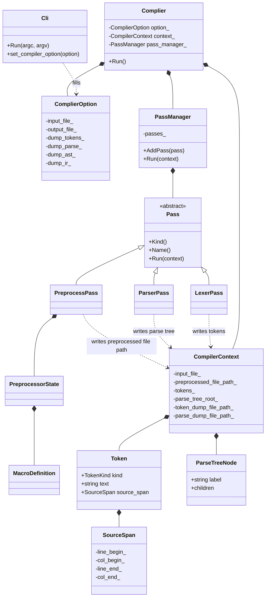

# Class Relationships

## Scope

This document describes the current class relationships in the SysyCC project.
It focuses on the active main path used by the executable.

## Main Relationship Graph



## Main Execution Path

The active runtime flow is:

```text
main
  -> Cli
  -> ComplierOption
  -> Complier
  -> PassManager
      -> PreprocessPass
      -> LexerPass
      -> ParserPass
```

## Class Roles

### `ClI::Cli`

Defined in:

- [cli.hpp](/Users/caojunze424/code/SysyCC/src/cli/cli.hpp)

Role:

- parse command line arguments
- store temporary CLI state
- translate CLI state into [ComplierOption](/Users/caojunze424/code/SysyCC/src/compiler/complier_option.hpp)

### `sysycc::ComplierOption`

Defined in:

- [complier_option.hpp](/Users/caojunze424/code/SysyCC/src/compiler/complier_option.hpp)

Role:

- store the configuration of one compile run
- carry file paths and dump switches

### `sysycc::Complier`

Defined in:

- [complier.hpp](/Users/caojunze424/code/SysyCC/src/compiler/complier.hpp)
- [complier.cpp](/Users/caojunze424/code/SysyCC/src/compiler/complier.cpp)

Role:

- own the compilation pipeline
- initialize passes
- invoke the pass manager

Owned objects:

- `ComplierOption`
- `CompilerContext`
- `PassManager`

### `sysycc::CompilerContext`

Defined in:

- [compiler_context.hpp](/Users/caojunze424/code/SysyCC/src/compiler/compiler_context/compiler_context.hpp)

Role:

- act as the shared data bus for passes
- store preprocessed intermediate file path
- store token stream
- store parse tree root
- store intermediate output paths

### `sysycc::Pass`

Defined in:

- [pass.hpp](/Users/caojunze424/code/SysyCC/src/compiler/pass/pass.hpp)

Role:

- abstract interface for one compiler stage

Current concrete subclasses:

- `PreprocessPass`
- `LexerPass`
- `ParserPass`

### `sysycc::PassManager`

Defined in:

- [pass.hpp](/Users/caojunze424/code/SysyCC/src/compiler/pass/pass.hpp)
- [pass.cpp](/Users/caojunze424/code/SysyCC/src/compiler/pass/pass.cpp)

Role:

- own pass objects
- prevent duplicate `PassKind`
- run passes in order

Current pipeline order:

- `PreprocessPass`
- `LexerPass`
- `ParserPass`

### `sysycc::LexerPass` and `sysycc::ParserPass`

Defined in:

- [lexer.hpp](/Users/caojunze424/code/SysyCC/src/frontend/lexer/lexer.hpp)
- [parser.hpp](/Users/caojunze424/code/SysyCC/src/frontend/parser/parser.hpp)

Role:

- connect generated `flex`/`bison` code directly with the pass system
- move lexer and parser output into [CompilerContext](/Users/caojunze424/code/SysyCC/src/compiler/compiler_context/compiler_context.hpp)

### `sysycc::PreprocessPass`, `sysycc::PreprocessorState`, and `sysycc::MacroDefinition`

Defined in:

- [preprocess.hpp](/Users/caojunze424/code/SysyCC/src/frontend/preprocess/preprocess.hpp)

Role:

- write preprocessed intermediate source files before lexical analysis
- describe object macro storage and preprocessing state
- provide the pass entry for `#define` and `#undef` style object-macro preprocessing

### `sysycc::Token`

Defined in:

- [compiler_context.hpp](/Users/caojunze424/code/SysyCC/src/compiler/compiler_context/compiler_context.hpp)

Role:

- represent one token in the token stream
- store token kind, source text, and [SourceSpan](/Users/caojunze424/code/SysyCC/src/common/source_span.hpp)

### `sysycc::SourceSpan`

Defined in:

- [source_span.hpp](/Users/caojunze424/code/SysyCC/src/common/source_span.hpp)

Role:

- represent source code begin/end positions
- serve as a reusable location object across modules

### `sysycc::ParseTreeNode`

Defined in:

- [parser_runtime.hpp](/Users/caojunze424/code/SysyCC/src/frontend/parser/parser_runtime.hpp)

Role:

- represent one node in the current parse tree
- store label and child node list

## Notes

- The active pass system lives under
  [src/compiler/pass](/Users/caojunze424/code/SysyCC/src/compiler/pass).
- The active frontend structure lives under
  [src/frontend/lexer](/Users/caojunze424/code/SysyCC/src/frontend/lexer),
  [src/frontend/parser](/Users/caojunze424/code/SysyCC/src/frontend/parser), and
  [src/frontend/preprocess](/Users/caojunze424/code/SysyCC/src/frontend/preprocess).
- The files under [src/pass](/Users/caojunze424/code/SysyCC/src/pass) are not
  the primary class relationship path anymore.
- The current architecture is front-end focused and has not yet introduced AST,
  semantic analysis classes, or IR classes.
