# Class Relationships

## Scope

This document describes the current class relationships in the SysyCC project.
It focuses on the active main path used by the executable.

## Main Relationship Graph

```mermaid
classDiagram
    class Cli {
        +Run(argc, argv)
        +set_compiler_option(option)
    }

    class Complier {
        -ComplierOption option_
        -CompilerContext context_
        -PassManager pass_manager_
        +Run()
    }

    class ComplierOption {
        -input_file_
        -output_file_
        -include_directories_
        -dump_tokens_
        -dump_parse_
        -dump_ast_
        -dump_ir_
    }

    class CompilerContext {
        -input_file_
        -preprocessed_file_path_
        -include_directories_
        -tokens_
        -parse_tree_root_
        -ast_root_
        -ast_complete_
        -semantic_model_
        -diagnostic_engine_
        -token_dump_file_path_
        -parse_dump_file_path_
        -ast_dump_file_path_
    }

    class PassManager {
        -passes_
        +AddPass(pass)
        +Run(context)
    }

    class Pass {
        <<abstract>>
        +Kind()
        +Name()
        +Run(context)
    }

    class LexerPass {
    }

    class ParserPass {
    }

    class AstPass {
    }

    class SemanticPass {
    }

    class Diagnostic {
        -level_
        -stage_
        -message_
        -source_span_
        +get_level()
        +get_stage()
        +get_message()
        +get_source_span()
    }

    class DiagnosticEngine {
        -diagnostics_
        +get_diagnostics()
        +clear()
        +has_error()
        +add_diagnostic()
        +add_error()
        +add_warning()
        +add_note()
    }

    class LexerState {
        -line_
        -column_
        -token_line_begin_
        -token_column_begin_
        -token_line_end_
        -token_column_end_
        -emit_parse_nodes_
        +reset()
        +update_position()
        +get_token_line_begin()
        +get_token_column_begin()
        +get_token_line_end()
        +get_token_column_end()
        +get_emit_parse_nodes()
        +set_emit_parse_nodes()
    }

    class PreprocessPass {
    }

    class PreprocessSession {
    }

    class PreprocessorRuntime {
    }

    class MacroDefinition {
    }

    class MacroTable {
    }

    class MacroExpander {
    }

    class ConditionalStack {
    }

    class DirectiveParser {
    }

    class IncludeResolver {
    }

    class FileLoader {
    }

    class Token {
        -TokenKind kind_
        -string text_
        -SourceSpan source_span_
        +get_kind()
        +get_text()
        +get_source_span()
        +get_category()
        +get_kind_name()
    }

    class SourceSpan {
        -line_begin_
        -col_begin_
        -line_end_
        -col_end_
    }

    class SourcePosition {
        -line_
        -column_
        +get_line()
        +get_column()
    }

    class ParseTreeNode {
        +string label
        +children
    }

    class AstNode {
        -AstKind kind_
        -SourceSpan source_span_
        +get_kind()
        +get_source_span()
    }

    class SemanticModel {
        -success_
        -diagnostics_
        -node_types_
        -symbol_bindings_
        -integer_constant_values_
        +get_success()
        +get_diagnostics()
        +get_node_type()
        +get_symbol_binding()
        +get_integer_constant_value()
    }

    class SemanticDiagnostic {
        -severity_
        -message_
        -source_span_
        +get_severity()
        +get_message()
        +get_source_span()
    }

    class SemanticSymbol {
        -kind_
        -name_
        -type_
        -decl_node_
        +get_kind()
        +get_name()
        +get_type()
        +get_decl_node()
    }

    class SemanticType {
        -kind_
        +get_kind()
    }

    class SemanticAnalyzer {
        +Analyze(translation_unit, semantic_context, scope_stack)
    }

    class DeclAnalyzer {
        +analyze_decl(decl, semantic_context, scope_stack)
    }

    class StmtAnalyzer {
        +analyze_stmt(stmt, semantic_context, scope_stack)
    }

    class ExprAnalyzer {
        +analyze_expr(expr, semantic_context, scope_stack)
    }

    class TypeResolver {
        +resolve_type(type_node, semantic_context)
        +apply_array_dimensions(base_type, dimensions, semantic_context)
    }

    class ConversionChecker {
        +is_assignable_type(target, value)
        +is_scalar_type(type)
        +is_integer_like_type(type)
    }

    class ConstantEvaluator {
        +get_integer_constant_value(node, semantic_context)
        +is_integer_constant_expr(expr, semantic_context, conversion_checker)
    }

    class SemanticContext {
        -compiler_context_
        -semantic_model_
        -current_function_
        -current_return_type_
        -loop_depth_
        -switch_depth_
        +get_compiler_context()
        +get_semantic_model()
        +get_loop_depth()
        +get_switch_depth()
    }

    class ScopeStack {
        -scopes_
        +push_scope()
        +pop_scope()
        +define(symbol)
        +lookup(name)
    }

    class BuiltinSymbols {
        +install(semantic_model, scope_stack)
    }

    class TranslationUnit {
        -top_level_decls_
        +get_top_level_decls()
    }

    class FunctionDecl {
        -name_
        -return_type_
        -parameters_
        -body_
        +get_name()
        +get_return_type()
        +get_parameters()
        +get_body()
    }

    class ParamDecl {
        -name_
        -declared_type_
        -dimensions_
        +get_name()
        +get_declared_type()
        +get_dimensions()
    }

    class FieldDecl {
        -name_
        -declared_type_
        -dimensions_
        +get_name()
        +get_declared_type()
        +get_dimensions()
    }

    class VarDecl {
        -name_
        -declared_type_
        -dimensions_
        -initializer_
        +get_name()
        +get_declared_type()
        +get_dimensions()
        +get_initializer()
    }

    class ConstDecl {
        -name_
        -declared_type_
        -dimensions_
        -initializer_
        +get_name()
        +get_declared_type()
        +get_dimensions()
        +get_initializer()
    }

    class StructDecl {
        -name_
        -fields_
        +get_name()
        +get_fields()
    }

    class EnumeratorDecl {
        -name_
        -value_
        +get_name()
        +get_value()
    }

    class EnumDecl {
        -name_
        -enumerators_
        +get_name()
        +get_enumerators()
    }

    class TypedefDecl {
        -name_
        -aliased_type_
        -dimensions_
        +get_name()
        +get_aliased_type()
        +get_dimensions()
    }

    class PointerTypeNode {
        -pointee_type_
        +get_pointee_type()
    }

    class StructTypeNode {
        -name_
        +get_name()
    }

    class EnumTypeNode {
        -name_
        +get_name()
    }

    class BlockStmt {
        -statements_
        +get_statements()
    }

    class DeclStmt {
        -declarations_
        +get_declarations()
    }

    class ExprStmt {
        -expression_
        +get_expression()
    }

    class IfStmt {
        -condition_
        -then_branch_
        -else_branch_
        +get_condition()
        +get_then_branch()
        +get_else_branch()
    }

    class WhileStmt {
        -condition_
        -body_
        +get_condition()
        +get_body()
    }

    class DoWhileStmt {
        -body_
        -condition_
        +get_body()
        +get_condition()
    }

    class ForStmt {
        -init_
        -condition_
        -step_
        -body_
        +get_init()
        +get_condition()
        +get_step()
        +get_body()
    }

    class SwitchStmt {
        -condition_
        -body_
        +get_condition()
        +get_body()
    }

    class CaseStmt {
        -value_
        -body_
        +get_value()
        +get_body()
    }

    class DefaultStmt {
        -body_
        +get_body()
    }

    class BreakStmt {
    }

    class ContinueStmt {
    }

    class ReturnStmt {
        -value_
        +get_value()
    }

    class IntegerLiteralExpr {
        -value_text_
        +get_value_text()
    }

    class FloatLiteralExpr {
        -value_text_
        +get_value_text()
    }

    class CharLiteralExpr {
        -value_text_
        +get_value_text()
    }

    class StringLiteralExpr {
        -value_text_
        +get_value_text()
    }

    class IdentifierExpr {
        -name_
        +get_name()
    }

    class UnaryExpr {
        -operator_text_
        -operand_
        +get_operator_text()
        +get_operand()
    }

    class PrefixExpr {
        -operator_text_
        -operand_
        +get_operator_text()
        +get_operand()
    }

    class PostfixExpr {
        -operator_text_
        -operand_
        +get_operator_text()
        +get_operand()
    }

    class BinaryExpr {
        -operator_text_
        -lhs_
        -rhs_
        +get_operator_text()
        +get_lhs()
        +get_rhs()
    }

    class AssignExpr {
        -lhs_
        -rhs_
        +get_lhs()
        +get_rhs()
    }

    class CallExpr {
        -callee_
        -arguments_
        +get_callee()
        +get_arguments()
    }

    class IndexExpr {
        -base_
        -index_
        +get_base()
        +get_index()
    }

    class MemberExpr {
        -operator_text_
        -base_
        -member_name_
        +get_operator_text()
        +get_base()
        +get_member_name()
    }

    class InitListExpr {
        -elements_
        +get_elements()
    }

    Cli ..> ComplierOption : fills
    Complier *-- ComplierOption
    Complier *-- CompilerContext
    Complier *-- PassManager
    PassManager *-- Pass
    Pass <|-- PreprocessPass
    Pass <|-- LexerPass
    Pass <|-- ParserPass
    Pass <|-- AstPass
    Pass <|-- SemanticPass
    LexerPass ..> CompilerContext : writes tokens
    LexerPass *-- LexerState
    ParserPass *-- LexerState
    ParserPass ..> CompilerContext : writes parse tree
    AstPass ..> CompilerContext : writes ast root
    SemanticPass ..> CompilerContext : writes semantic model
    PreprocessPass ..> CompilerContext : writes preprocessed file path
    PreprocessPass ..> DiagnosticEngine : emits diagnostics
    LexerPass ..> DiagnosticEngine : emits diagnostics
    ParserPass ..> DiagnosticEngine : emits diagnostics
    AstPass ..> DiagnosticEngine : emits diagnostics
    SemanticPass ..> DiagnosticEngine : emits diagnostics
    PreprocessPass ..> PreprocessSession
    PreprocessSession *-- PreprocessorRuntime
    PreprocessorRuntime *-- MacroDefinition
    PreprocessSession *-- MacroTable
    PreprocessSession *-- MacroExpander
    PreprocessSession *-- ConditionalStack
    PreprocessSession *-- DirectiveParser
    PreprocessSession *-- IncludeResolver
    PreprocessSession *-- FileLoader
    CompilerContext *-- Token
    CompilerContext *-- ParseTreeNode
    CompilerContext *-- AstNode
    CompilerContext *-- SemanticModel
    CompilerContext *-- DiagnosticEngine
    DiagnosticEngine *-- Diagnostic
    AstNode <|-- TranslationUnit
    AstNode <|-- FunctionDecl
    AstNode <|-- ParamDecl
    AstNode <|-- FieldDecl
    AstNode <|-- VarDecl
    AstNode <|-- ConstDecl
    AstNode <|-- StructDecl
    AstNode <|-- EnumeratorDecl
    AstNode <|-- EnumDecl
    AstNode <|-- TypedefDecl
    AstNode <|-- BlockStmt
    AstNode <|-- DeclStmt
    AstNode <|-- ExprStmt
    AstNode <|-- IfStmt
    AstNode <|-- WhileStmt
    AstNode <|-- DoWhileStmt
    AstNode <|-- ForStmt
    AstNode <|-- SwitchStmt
    AstNode <|-- CaseStmt
    AstNode <|-- DefaultStmt
    AstNode <|-- BreakStmt
    AstNode <|-- ContinueStmt
    AstNode <|-- ReturnStmt
    AstNode <|-- AssignExpr
    AstNode <|-- IntegerLiteralExpr
    AstNode <|-- FloatLiteralExpr
    AstNode <|-- CharLiteralExpr
    AstNode <|-- StringLiteralExpr
    AstNode <|-- IdentifierExpr
    AstNode <|-- UnaryExpr
    AstNode <|-- PrefixExpr
    AstNode <|-- PostfixExpr
    AstNode <|-- BinaryExpr
    AstNode <|-- CallExpr
    AstNode <|-- IndexExpr
    AstNode <|-- MemberExpr
    AstNode <|-- InitListExpr
    AstNode <|-- PointerTypeNode
    AstNode <|-- StructTypeNode
    AstNode <|-- EnumTypeNode
    TranslationUnit *-- FunctionDecl
    TranslationUnit *-- StructDecl
    TranslationUnit *-- EnumDecl
    TranslationUnit *-- TypedefDecl
    TranslationUnit *-- VarDecl
    TranslationUnit *-- ConstDecl
    StructDecl *-- FieldDecl
    EnumDecl *-- EnumeratorDecl
    TypedefDecl *-- PointerTypeNode
    FunctionDecl *-- BlockStmt
    PointerTypeNode *-- BuiltinTypeNode
    PointerTypeNode *-- StructTypeNode
    ReturnStmt *-- IntegerLiteralExpr
    MemberExpr *-- IdentifierExpr
    SemanticPass ..> SemanticAnalyzer
    SemanticAnalyzer ..> DeclAnalyzer
    SemanticAnalyzer ..> StmtAnalyzer
    SemanticAnalyzer ..> ExprAnalyzer
    SemanticAnalyzer ..> TypeResolver
    SemanticAnalyzer ..> ConversionChecker
    SemanticAnalyzer ..> ConstantEvaluator
    SemanticPass ..> SemanticContext
    SemanticPass ..> ScopeStack
    SemanticPass ..> BuiltinSymbols
    DeclAnalyzer ..> ExprAnalyzer
    DeclAnalyzer ..> TypeResolver
    DeclAnalyzer ..> ConversionChecker
    DeclAnalyzer ..> ConstantEvaluator
    StmtAnalyzer ..> DeclAnalyzer
    StmtAnalyzer ..> ExprAnalyzer
    StmtAnalyzer ..> ConversionChecker
    StmtAnalyzer ..> ConstantEvaluator
    ExprAnalyzer ..> TypeResolver
    ExprAnalyzer ..> ConversionChecker
    ExprAnalyzer ..> ConstantEvaluator
    SemanticContext *-- SemanticModel
    SemanticModel *-- SemanticDiagnostic
    SemanticModel *-- SemanticSymbol
    SemanticModel *-- SemanticType
    Token *-- SourceSpan
    Diagnostic *-- SourceSpan
    SourceSpan ..> SourcePosition
```



## Main Execution Path

The active runtime flow is:

```text
main
  -> Cli
  -> ComplierOption
  -> Complier
  -> PassManager
      -> PreprocessPass
      -> LexerPass
      -> ParserPass
      -> AstPass
      -> SemanticPass
```

## Class Roles

### `ClI::Cli`

Defined in:

- [cli.hpp](/Users/caojunze424/code/SysyCC/src/cli/cli.hpp)

Role:

- parse command line arguments
- store temporary CLI state
- translate CLI state into [ComplierOption](/Users/caojunze424/code/SysyCC/src/compiler/complier_option.hpp)

### `sysycc::ComplierOption`

Defined in:

- [complier_option.hpp](/Users/caojunze424/code/SysyCC/src/compiler/complier_option.hpp)

Role:

- store the configuration of one compile run
- carry file paths, include search directories, and dump switches

### `sysycc::Complier`

Defined in:

- [complier.hpp](/Users/caojunze424/code/SysyCC/src/compiler/complier.hpp)
- [complier.cpp](/Users/caojunze424/code/SysyCC/src/compiler/complier.cpp)

Role:

- own the compilation pipeline
- initialize passes
- invoke the pass manager

Owned objects:

- `ComplierOption`
- `CompilerContext`
- `PassManager`

### `sysycc::CompilerContext`

Defined in:

- [compiler_context.hpp](/Users/caojunze424/code/SysyCC/src/compiler/compiler_context/compiler_context.hpp)

Role:

- act as the shared data bus for passes
- store preprocessed intermediate file path
- store include search directories for preprocessing
- store token stream with exact lexical token kinds plus derived categories
- store parse tree root
- store ast root
- store whether the current ast is complete enough for ast-consuming stages
- store semantic analysis results in a separate semantic model
- store compiler-wide diagnostics in a shared diagnostic engine
- store intermediate output paths

### `sysycc::Pass`

Defined in:

- [pass.hpp](/Users/caojunze424/code/SysyCC/src/compiler/pass/pass.hpp)

Role:

- abstract interface for one compiler stage

Current concrete subclasses:

- `PreprocessPass`
- `LexerPass`
- `ParserPass`
- `AstPass`
- `SemanticPass`

### `sysycc::PreprocessPass`

Defined in:

- [preprocess.hpp](/Users/caojunze424/code/SysyCC/src/frontend/preprocess/preprocess.hpp)
- [preprocess.cpp](/Users/caojunze424/code/SysyCC/src/frontend/preprocess/preprocess.cpp)

Role:

- expose the only public class of the preprocess module
- run the preprocessing stage before lexical analysis through `detail::PreprocessSession`
- write the preprocessed intermediate file path back into `CompilerContext`

### `sysycc::PassManager`

Defined in:

- [pass.hpp](/Users/caojunze424/code/SysyCC/src/compiler/pass/pass.hpp)
- [pass.cpp](/Users/caojunze424/code/SysyCC/src/compiler/pass/pass.cpp)

Role:

- own pass objects
- prevent duplicate `PassKind`
- run passes in order

Current pipeline order:

- `PreprocessPass`
- `LexerPass`
- `ParserPass`
- `AstPass`
- `SemanticPass`

### `sysycc::LexerPass` and `sysycc::ParserPass`

Defined in:

- [lexer.hpp](/Users/caojunze424/code/SysyCC/src/frontend/lexer/lexer.hpp)
- [parser.hpp](/Users/caojunze424/code/SysyCC/src/frontend/parser/parser.hpp)

Role:

- connect generated `flex`/`bison` code directly with the pass system
- move lexer and parser output into [CompilerContext](/Users/caojunze424/code/SysyCC/src/compiler/compiler_context/compiler_context.hpp)
- keep lexer-only runs free of parser-runtime terminal-node allocation
- enable scanner-side terminal-node creation only for parser-driven runs
- create independent scanner sessions with their own lexer runtime state

### `sysycc::AstPass`

Defined in:

- [ast_pass.hpp](/Users/caojunze424/code/SysyCC/src/frontend/ast/ast_pass.hpp)
- [ast_pass.cpp](/Users/caojunze424/code/SysyCC/src/frontend/ast/ast_pass.cpp)

Role:

- lower the parser runtime tree into a compiler-facing AST
- write the ast root into [CompilerContext](/Users/caojunze424/code/SysyCC/src/compiler/compiler_context/compiler_context.hpp)
- emit `*.ast.txt` intermediate artifacts when `--dump-ast` is enabled
- preserve compiler-facing declarations for parsed `struct`, `enum`, and `typedef` syntax instead of dropping them into `UnknownDecl`
- record whether the lowered AST is complete via `CompilerContext::get_ast_complete()`
- reject AST results that still contain `Unknown*` placeholders when AST dumping is explicitly requested

### `sysycc::SemanticPass`

Defined in:

- [semantic_pass.hpp](/Users/caojunze424/code/SysyCC/src/frontend/semantic/semantic_pass.hpp)
- [semantic_pass.cpp](/Users/caojunze424/code/SysyCC/src/frontend/semantic/semantic_pass.cpp)

Role:

- consume the lowered AST after `AstPass`
- create a `SemanticModel` and store it back into [CompilerContext](/Users/caojunze424/code/SysyCC/src/compiler/compiler_context/compiler_context.hpp)
- install builtin runtime-library symbols before traversing user AST nodes
- emit unified stage-tagged diagnostics into the shared diagnostic engine
- record semantic diagnostics in both the `SemanticModel` and the compiler-wide diagnostic engine

### `sysycc::Diagnostic` and `sysycc::DiagnosticEngine`

Defined in:

- [diagnostic.hpp](/Users/caojunze424/code/SysyCC/src/common/diagnostic/diagnostic.hpp)
- [diagnostic_engine.hpp](/Users/caojunze424/code/SysyCC/src/common/diagnostic/diagnostic_engine.hpp)

Role:

- represent one pass-independent diagnostic entry with level, stage, message,
  and [SourceSpan](/Users/caojunze424/code/SysyCC/src/common/source_span.hpp)
- provide one shared collection interface through
  [CompilerContext](/Users/caojunze424/code/SysyCC/src/compiler/compiler_context/compiler_context.hpp)
- let preprocessing, lexing, parsing, AST lowering, and semantic analysis emit
  diagnostics through one common API

### `sysycc::LexerState`

Defined in:

- [lexer.hpp](/Users/caojunze424/code/SysyCC/src/frontend/lexer/lexer.hpp)

Role:

- store one scanner session's line/column tracking
- store the current token source span
- control whether scanner actions should emit parse-tree terminal nodes

### `sysycc::preprocess::detail::PreprocessSession`

Defined in:

- [preprocess_session.hpp](/Users/caojunze424/code/SysyCC/src/frontend/preprocess/detail/preprocess_session.hpp)
- [preprocess_session.cpp](/Users/caojunze424/code/SysyCC/src/frontend/preprocess/detail/preprocess_session.cpp)

Role:

- coordinate one full preprocessing run
- dispatch lines between directive parsing, macro handling, include handling, and conditional handling
- write the final `.preprocessed.sy` artifact

### `sysycc::preprocess::detail::PreprocessorRuntime`, `MacroTable`, `MacroExpander`, `ConditionalStack`, `DirectiveParser`, `IncludeResolver`, `FileLoader`, and `MacroDefinition`

Defined in:

- [preprocess_runtime.hpp](/Users/caojunze424/code/SysyCC/src/frontend/preprocess/detail/preprocess_runtime.hpp)
- [macro_table.hpp](/Users/caojunze424/code/SysyCC/src/frontend/preprocess/detail/macro_table.hpp)
- [macro_expander.hpp](/Users/caojunze424/code/SysyCC/src/frontend/preprocess/detail/macro_expander.hpp)
- [conditional_stack.hpp](/Users/caojunze424/code/SysyCC/src/frontend/preprocess/detail/conditional_stack.hpp)
- [directive_parser.hpp](/Users/caojunze424/code/SysyCC/src/frontend/preprocess/detail/directive_parser.hpp)
- [include_resolver.hpp](/Users/caojunze424/code/SysyCC/src/frontend/preprocess/detail/include_resolver.hpp)
- [file_loader.hpp](/Users/caojunze424/code/SysyCC/src/frontend/preprocess/detail/file_loader.hpp)

Role:

- `PreprocessRuntime`: store preprocessing output lines and file traversal state
- `MacroTable`: manage object-like macro definitions
- `MacroExpander`: expand ordinary source lines with macro substitutions
- `ConditionalStack`: manage nested `#if/#ifdef/#ifndef/#elif/#else/#endif` state
- `DirectiveParser`: parse raw directive text into structured directives
- `IncludeResolver`: resolve local `#include "..."` directives through current-directory and `-I` search paths
- `FileLoader`: load source files into line sequences
- `MacroDefinition`: describe one object-like macro definition

### `sysycc::Token`

Defined in:

- [compiler_context.hpp](/Users/caojunze424/code/SysyCC/src/compiler/compiler_context/compiler_context.hpp)

Role:

- represent one token in the token stream
- store token kind, source text, and [SourceSpan](/Users/caojunze424/code/SysyCC/src/common/source_span.hpp)

### `sysycc::SourceSpan`

Defined in:

- [source_span.hpp](/Users/caojunze424/code/SysyCC/src/common/source_span.hpp)

Role:

- represent source code begin/end positions
- serve as a reusable location object across modules

### `sysycc::ParseTreeNode`

Defined in:

- [parser_runtime.hpp](/Users/caojunze424/code/SysyCC/src/frontend/parser/parser_runtime.hpp)

Role:

- represent one node in the current parse tree
- store label and child node list

### `sysycc::AstNode` and derived nodes

Defined in:

- [ast_node.hpp](/Users/caojunze424/code/SysyCC/src/frontend/ast/ast_node.hpp)

Role:

- provide a smaller compiler-facing tree than the grammar-shaped parse tree
- keep a stable `AstKind` and [SourceSpan](/Users/caojunze424/code/SysyCC/src/common/source_span.hpp) on every AST node
- organize the first AST layer into `TranslationUnit`, `FunctionDecl`,
  `VarDecl`, `ConstDecl`, `PointerTypeNode`, `BlockStmt`, `ReturnStmt`,
  `IntegerLiteralExpr`, `FloatLiteralExpr`, `CharLiteralExpr`,
  `StringLiteralExpr`, `IdentifierExpr`, `UnaryExpr`, `PrefixExpr`,
  `PostfixExpr`, `BinaryExpr`, `CallExpr`, `IndexExpr`, `MemberExpr`
  (for both `.` and `->`),
  `InitListExpr`, and `Unknown*` placeholders

### `sysycc::SemanticModel`, `SemanticDiagnostic`, `SemanticSymbol`, `SemanticType`, and semantic helpers

Defined in:

- [semantic_model.hpp](/Users/caojunze424/code/SysyCC/src/frontend/semantic/model/semantic_model.hpp)
- [semantic_diagnostic.hpp](/Users/caojunze424/code/SysyCC/src/frontend/semantic/model/semantic_diagnostic.hpp)
- [semantic_symbol.hpp](/Users/caojunze424/code/SysyCC/src/frontend/semantic/model/semantic_symbol.hpp)
- [semantic_type.hpp](/Users/caojunze424/code/SysyCC/src/frontend/semantic/model/semantic_type.hpp)
- [semantic_analyzer.hpp](/Users/caojunze424/code/SysyCC/src/frontend/semantic/analysis/semantic_analyzer.hpp)
- [decl_analyzer.hpp](/Users/caojunze424/code/SysyCC/src/frontend/semantic/analysis/decl_analyzer.hpp)
- [stmt_analyzer.hpp](/Users/caojunze424/code/SysyCC/src/frontend/semantic/analysis/stmt_analyzer.hpp)
- [expr_analyzer.hpp](/Users/caojunze424/code/SysyCC/src/frontend/semantic/analysis/expr_analyzer.hpp)
- [type_resolver.hpp](/Users/caojunze424/code/SysyCC/src/frontend/semantic/type_system/type_resolver.hpp)
- [conversion_checker.hpp](/Users/caojunze424/code/SysyCC/src/frontend/semantic/type_system/conversion_checker.hpp)
- [constant_evaluator.hpp](/Users/caojunze424/code/SysyCC/src/frontend/semantic/type_system/constant_evaluator.hpp)
- [semantic_context.hpp](/Users/caojunze424/code/SysyCC/src/frontend/semantic/support/semantic_context.hpp)
- [scope_stack.hpp](/Users/caojunze424/code/SysyCC/src/frontend/semantic/support/scope_stack.hpp)
- [builtin_symbols.hpp](/Users/caojunze424/code/SysyCC/src/frontend/semantic/support/builtin_symbols.hpp)

Role:

- `SemanticModel`: store semantic success, diagnostics, node-type bindings,
  node-symbol bindings, and foldable integer constant-expression values
- `SemanticDiagnostic`: represent one semantic warning/error with a source span
- `SemanticSymbol`: represent one resolved declaration symbol
- `SemanticType`: represent semantic types such as builtin, pointer, array, function, struct, and enum
- `SemanticAnalyzer`: orchestrate the specialized semantic helpers over one
  complete AST
- `DeclAnalyzer`: enforce declaration-level rules and register non-function
  symbols
- `StmtAnalyzer`: enforce statement/control-flow rules
- `ExprAnalyzer`: enforce expression/operator rules and bind expression types
- `TypeResolver`: lower AST type nodes into semantic types
- `ConversionChecker`: answer type-compatibility and operand-category questions
- `ConstantEvaluator`: query and store foldable integer constant-expression
  results
- `SemanticContext`: carry one analysis run's transient state
- `ScopeStack`: manage nested lexical scopes
- `BuiltinSymbols`: install runtime-library builtins into the initial scope
- `SemanticPass`: run strict semantic checks only after AST lowering is marked
  complete, while still attaching a semantic model to the compiler context

## Notes

- The active pass system lives under
  [src/compiler/pass](/Users/caojunze424/code/SysyCC/src/compiler/pass).
- The active frontend structure lives under
  [src/frontend/ast](/Users/caojunze424/code/SysyCC/src/frontend/ast),
  [src/frontend/lexer](/Users/caojunze424/code/SysyCC/src/frontend/lexer),
  [src/frontend/parser](/Users/caojunze424/code/SysyCC/src/frontend/parser), and
  [src/frontend/preprocess](/Users/caojunze424/code/SysyCC/src/frontend/preprocess).
- The files under [src/pass](/Users/caojunze424/code/SysyCC/src/pass) are not
  the primary class relationship path anymore.
- The current architecture is front-end focused and now includes AST and an
  initial semantic-analysis layer, but IR classes and backend code generation
  have not been introduced yet.
