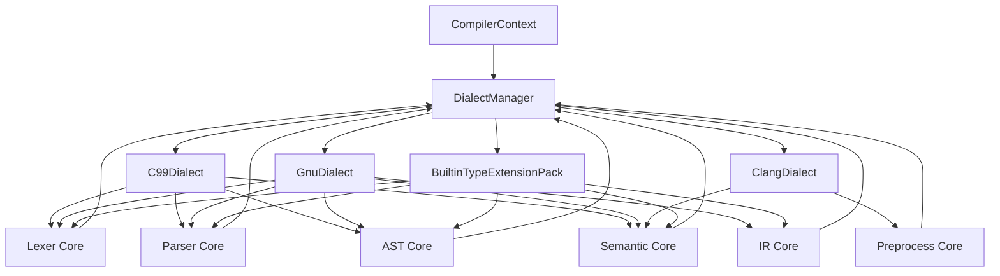
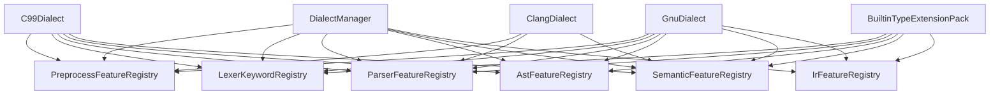

# Frontend Dialect Refactor Plan

## 背景与目标

`SysyCC` 的长期目标不是只支持一条固定的语言子集，而是同时支持：

- `SysY22`
- 标准 `C`
- 面向真实工具链兼容所需的 GNU C / Clang / 平台 builtin type 增量能力

本计划基于一个前提：

- `SysY22` 可以视为 `C99` 能力边界中的受限子集
- 因此当前阶段不单独引入 `LanguageProfile` 抽象
- dialect 架构里的“语言基线”直接以 `C99Dialect` 表达
- `SysY22` 的收敛边界由测试、语义规则、CLI 模式或后续约束配置来体现，而不是额外引入一层新的 profile 类型

当前代码已经开始出现这几类能力并存的情况：

- 标准 C99 能力
  - `extern`
  - `inline`
  - `const`
  - `typedef`
  - `union`
  - cast
  - 更完整的 declaration-specifier 组合
- GNU C 扩展
  - `__attribute__((...))`
  - `__signed`
  - `__builtin_*`
- Clang 风格扩展
  - `__has_feature`
  - `__has_extension`
  - `__has_builtin`
  - `__has_attribute`
  - `__has_cpp_attribute`
- 扩展 builtin type
  - `_Float16`

如果继续把这些能力直接散落在 lexer / parser / AST / semantic / IR 的各自实现里，后续会越来越难以回答这几个问题：

- 某个语法点到底是标准 C 还是 GNU 扩展
- 某个 token/语法/语义是否可以按“方言开关”控制
- 某个新增能力应该进入哪一层，如何测试，如何文档化

因此，本计划的目标是建立一个**可持续演进的方言化前端架构**：

- 保持一条共享的前端核心主链
- 让 `C99`、`GNU`、`Clang`、`Builtin Types` 成为纵向能力包
- 在各阶段通过统一扩展接口参与，而不是各阶段横向复制一套实现

当前第一批地基已经落地：

- `DialectManager` 已经开始聚合 preprocess / lexer / parser / AST /
  semantic / IR registry
- `FrontendDialect` 已经显式暴露 preprocess feature 扩展位
- `LexerKeywordRegistry` 已经不再对冲突关键字做静默覆盖
- lexer 与 parser 自用 scanner session 现在都已经在 runtime
  通过 `LexerKeywordRegistry` 完成 `identifier -> keyword` 分类
- 轻量架构回归已经覆盖默认 dialect 聚合和 keyword 冲突策略
- 第一批 handler bridge 也已经开始落地：
  - `PreprocessProbeHandlerRegistry`
  - `PreprocessDirectiveHandlerRegistry`
  - `AttributeSemanticHandlerRegistry`
  - `BuiltinTypeSemanticHandlerRegistry`
  - `IrExtensionLoweringRegistry`

后续阶段将继续在这套骨架上推进 handler/service 层，而不是回到
stage-local 的散点分支实现。

## 总体架构判断

建议把语言支持明确划分成两层。

### 第一层：核心前端主链

这一层负责所有共享基础设施，不与特定方言绑定：

- token / source / diagnostic
- parse tree / AST 基础节点
- semantic model 基础设施
- IR 基础设施
- pass 调度
- preprocess 公共框架

这层的职责是“提供稳定主链和扩展点”，而不是直接表达 GNU 或 Clang 细节。

### 第二层：方言/扩展模块层

这一层承载具体语言包：

- `C99Dialect`
- `GnuDialect`
- `ClangDialect`
- `BuiltinTypeExtensionPack`

这些模块不是核心主链的替代物，而是：

- 向主链注册能力
- 声明自己贡献哪些 token / feature / rule / lowering
- 在不破坏主链一致性的前提下，为特定语言来源提供增量支持

## 设计原则

### 1. C99 是基线，不是“插件化附加项”

虽然实现上可以命名为 `C99Dialect`，但它的定位应当是：

- 默认启用
- 定义标准 C 主边界
- 为 GNU / Clang / builtin-type 扩展提供对照基线

### 2. GNU / Clang / Builtin Types 是增量能力包

- `GnuDialect` 负责 GNU C 语法、attribute、builtin 兼容
- `ClangDialect` 负责 clang 风格 probe / extension
- `BuiltinTypeExtensionPack` 只负责**编译器扩展 builtin scalar types**
  - `_Float16`
  - 后续 `_Float32` / `_Float64x`
  - 不直接吸收平台 ABI typedef 或 target-specific 结构化类型

### 2.1 Toolchain / Target 兼容不属于 dialect 系统

必须明确区分这三类问题：

- 语言基线
  - `C99Dialect`
- 编译器/方言扩展
  - `GnuDialect`
  - `ClangDialect`
  - `BuiltinTypeExtensionPack`
- toolchain / target / ABI 兼容
  - host compiler 预定义宏
  - target data layout
  - ABI 调用约定
  - SDK/system header 的平台 typedef 约束

最后这一类不应该继续塞进 `DialectManager`。

建议长期边界是：

- dialect 负责“这门语言/这个编译器扩展长什么样”
- toolchain compatibility service 负责“当前宿主/目标环境要求什么”

也就是说：

- `_Float16` 这类编译器扩展 builtin type 可以归 `BuiltinTypeExtensionPack`
- 但平台 ABI typedef、target-specific layout、host/target 默认宏值等，应当留在 dialect 系统之外

### 3. 模块化方向应当是“纵向贯穿”，不是“每层横向复制”

不推荐这样做：

```text
lexer/c99
lexer/gnu
lexer/clang
parser/c99
parser/gnu
parser/clang
...
```

因为同一个语言特性会被拆散到很多平行目录里，长期维护成本会非常高。

更推荐的是：

- 每个 dialect 是一个“纵向能力包”
- 在 lexer / parser / AST / semantic / IR 中分别贡献能力
- 由 `DialectManager` 统一聚合

### 4. `typedef-name` 属于核心语言建模，不是普通扩展开关

`typedef-name` 虽然会在 `C99Dialect` 的能力清单里出现，但它的真实实现性质应当是：

- parser 允许“命名类型”语法占位
- AST 保留统一的命名类型节点
- semantic 基于作用域和符号表解析它是否真的是 `TypedefName`

也就是说：

- `C99Dialect` 只声明“标准 C 需要这条能力”
- 但不要把它误做成一个纯 parser feature gate
- 它本质上属于 core type-name resolution service

## 推荐目录结构

```text
src/frontend/
├── core/
│   ├── lexer/
│   ├── parser/
│   ├── ast/
│   ├── semantic/
│   └── ir/
└── dialects/
    ├── dialect.hpp
    ├── dialect_manager.hpp
    ├── preprocess_feature_registry.hpp
    ├── lexer_keyword_registry.hpp
    ├── parser_feature_registry.hpp
    ├── ast_feature_registry.hpp
    ├── semantic_feature_registry.hpp
    ├── ir_feature_registry.hpp
    ├── c99/
    ├── gnu/
    ├── clang/
    └── builtin_types/
```

说明：

- `dialects/` 是明确的方言化承载层
- `core/` 现在已经落成真实目录，承载共享接口和 `DialectManager`
- `registries/` 现在承载各阶段 feature gate、ownership map 和 lowering registry
- `packs/` 现在承载具体的 C99/GNU/Clang/builtin-type dialect 实现

## 核心类与职责

### `FrontendDialect`

统一的方言接口。

职责：

- 对外暴露 dialect 名称
- 向不同阶段注册能力
- 不要求每个 dialect 必须实现所有阶段

建议接口：

```cpp
class FrontendDialect {
  public:
    virtual ~FrontendDialect() = default;

    virtual std::string_view get_name() const noexcept = 0;

    virtual void contribute_preprocess_features(
        PreprocessFeatureRegistry &registry) const {}

    virtual void contribute_lexer_keywords(
        LexerKeywordRegistry &registry) const {}

    virtual void contribute_parser_features(
        ParserFeatureRegistry &registry) const {}

    virtual void contribute_ast_features(
        AstFeatureRegistry &registry) const {}

    virtual void contribute_semantic_features(
        SemanticFeatureRegistry &registry) const {}

    virtual void contribute_ir_features(
        IrFeatureRegistry &registry) const {}
};
```

### `DialectManager`

统一管理当前启用的 dialect 集合和阶段注册表。

职责：

- 注册方言包
- 汇总方言名称
- 暴露 preprocess / lexer / parser / AST / semantic / IR 的共享 registry

`DialectManager` 的职责边界也需要明确：

- 它只聚合 dialect/extension pack 的声明信息
- 它不直接承载 target/ABI/toolchain compatibility 数据
- 它不应成为“任何前端配置都往里塞”的超级对象

### `PreprocessFeatureRegistry`

职责：

- 保存 preprocess 允许或接管的方言能力
- 让 clang probe、GNU 预处理扩展、非标准 directive 有统一归属

典型 feature：

- `ClangBuiltinProbes`
- `HasIncludeFamily`
- `GnuPredefinedMacros`
- `NonStandardDirectivePayloads`

### `LexerKeywordRegistry`

职责：

- 保存“额外关键字 -> `TokenKind`”映射
- 让 lexer 在不把所有扩展关键字硬编码到主逻辑的前提下，逐步切换到 registry 驱动

### `ParserFeatureRegistry`

职责：

- 保存 parser 允许的扩展 feature
- 给统一 grammar 提供 feature gate

典型 feature：

- `FunctionPrototypeDeclarations`
- `ExternVariableDeclarations`
- `QualifiedPrototypeParameters`
- `UnionDeclarations`
- `GnuAttributeSpecifiers`
- `ExtendedBuiltinTypeSpecifiers`

这里刻意不把 `TypedefNameTypeSpecifiers` 视为“普通 feature 开关”，
因为它需要和作用域敏感的 semantic 名字解析协作，而不是只由 grammar
静态决定。

### `AstFeatureRegistry`

职责：

- 描述 AST lowering 层允许出现的扩展节点或 lowering 路径

### `SemanticFeatureRegistry`

职责：

- 描述 semantic 需要接管的扩展规则
- 后续可进一步演进成 handler/dispatcher registry

### `IrFeatureRegistry`

职责：

- 描述 IR lowering 允许消费的扩展语义
- 例如 GNU function attribute lowering、扩展 builtin type lowering

### 关于 feature registry 与 handler registry 的分工

这份计划需要明确区分两个阶段：

#### 阶段一：feature registry

目标：

- 先完成“分类”和“开关语义”
- 明确哪些阶段应该感知某类方言能力

这一阶段 registry 更偏：

- capability declaration
- feature gate
- 分类收口

#### 阶段二：handler registry / service registry

目标：

- 真正把扩展语义从 stage 内部 `if` 分支里拆出来

例如后续会逐步引入：

- preprocess probe handler registry
- preprocess directive handler registry
- semantic attribute handler registry
- semantic builtin-type handler registry
- IR attribute / builtin-type lowering handler registry

也就是说：

- 当前 `*FeatureRegistry` 不等于最终扩展执行框架
- 它是面向后续 handler/service 分层的第一步

### 关于未来 service/handler 命名的冻结建议

为了避免后续一直停留在“feature 已分类，但逻辑仍然散落”的半成品状态，建议现在就冻结后续服务层的命名：

- `TypeNameResolutionService`
  - 负责 `typedef-name` / named type 的语义解析
- `PreprocessProbeHandlerRegistry`
  - 负责 `__has_*`、builtin probes 等 probe 族扩展
- `PreprocessDirectiveHandlerRegistry`
  - 负责非标准 directive 的执行扩展
- `AttributeSemanticHandlerRegistry`
  - 负责 GNU/Clang attribute 的语义处理
- `BuiltinTypeSemanticHandlerRegistry`
  - 负责 `_Float16` 等扩展 builtin type 的语义规则
- `IrExtensionLoweringRegistry`
  - 负责扩展 attribute / builtin type / builtin symbol 的 IR lowering

这层命名冻结的意义是：

- feature registry 负责“阶段是否感知这类能力”
- handler/service registry 负责“谁真正执行这类能力”
- 后续代码实现不会反复更换术语

## Dialect 划分建议

### `C99Dialect`

职责：

- 标准 C99 关键字
- 标准 declaration-specifier 组合
- `typedef-name`
- `union`
- cast
- prototype
- storage specifier
- type qualifier

它是默认启用的前端语言基线。

### `GnuDialect`

职责：

- `__attribute__((...))`
- `__signed`
- `__inline__`
- `__const__`
- `__builtin_*`

后续可继续扩展：

- `__typeof__`
- `__extension__`
- statement expression

### `ClangDialect`

职责：

- `__has_feature`
- `__has_extension`
- `__has_builtin`
- `__has_attribute`
- `__has_cpp_attribute`
- `__building_module`

主要作用阶段：

- preprocess
- semantic compatibility / probe resolution

### `BuiltinTypeExtensionPack`

职责：

- `_Float16`
- 后续 `_Float32` / `_Float64x` 等扩展 builtin type
- 编译器扩展 builtin scalar type 的 lexer / parser / semantic / IR 接入

不建议放进这个 pack 的内容：

- 平台 ABI typedef
- target-specific aggregate layout
- 依赖 OS / SDK 的命名类型别名

这些内容更适合未来放进：

- toolchain compatibility layer
- target info / ABI service
- system-header compatibility support

## 各阶段接入方式

### Lexer

不要继续无限扩张硬编码关键字表。

目标形态：

- 保留核心 token 流程
- 在“identifier -> keyword”这一步接入 `LexerKeywordRegistry`

例如：

- `C99Dialect` 注册 `signed`, `short`, `inline`
- `GnuDialect` 注册 `__attribute__`, `__signed`
- `BuiltinTypeExtensionPack` 注册 `_Float16`

这里还需要一个明确约束：

- 同一个 keyword 文本不允许被不同 dialect 贡献成不同 `TokenKind`
- 如果确实出现这种情况，注册阶段必须显式报错
- 不能依赖“后注册覆盖前注册”的隐式规则

### Parser

parser 不适合追求完全插件化 grammar。

更现实的目标是：

- 一份统一 grammar
- 预留统一非终结符和扩展插槽
- 通过 `ParserFeatureRegistry` 决定哪些扩展路径被允许

例如统一保留：

- `attribute_specifier`
- `extended_builtin_type`
- `storage_specifier`
- `type_qualifier`

但 `typedef-name` 这条链的推荐实现方式是：

- grammar 允许“命名类型引用”
- semantic 再判断它是否绑定到 `TypedefName`
- 不把它单纯视为 parser feature toggle

因此 parser 层的长期边界是：

- grammar 只表达“这里允许命名类型引用”
- `TypeNameResolutionService` 决定它是不是合法 typedef-name

### AST

AST 不按 dialect 分裂。

原则：

- AST 节点体系统一
- dialect 只决定哪些节点可以被构造

例如：

- `ParsedAttributeList`
- `QualifiedTypeNode`
- `NamedTypeNode`
- `BuiltinTypeNode("_Float16")`

### Semantic

语义分析更适合使用 registry/handler 模式。

后续建议逐步演进到：

- builtin type handler
- builtin symbol handler
- function attribute handler
- extension probe handler

这里再补一个约束：

- semantic handler 的归属必须唯一
- 同一个 attribute/type/builtin symbol 的最终解释不能依赖 dialect 注册顺序

### IR

IR 仍然维持统一主链，但允许 dialect 提供 lowering feature。

例如：

- GNU: `__always_inline__ -> alwaysinline`
- builtin types: `_Float16 -> half`

同样需要约束：

- 同一个扩展 lowering key 只能有一个最终 owner
- 如果多个 dialect 试图为同一语义键注册 lowering，必须在注册阶段失败

## 模块图

### 总体图



### 更细粒度的 registry 图



## 风险与约束

### 1. Parser 无法完全插件化

这点必须明确接受。

建议：

- grammar 仍然保持统一
- dialect 主要通过 feature gate 和预留非终结符参与
- 不追求运行时动态装配 grammar

### 2. 不能让方言模块反过来污染核心主链

例如：

- 不要在 `core/` 里大量直接引用某个具体 dialect 类
- 应由 `DialectManager` 聚合，再向下游提供 registry/service

### 3. Dialect 模块不能替代正常语言建模

例如：

- `typedef-name`
- `const`
- `union`
- cast

这些依然属于标准 C 主链能力，不能因为做了 dialect 架构就把它们当成“插件化可有可无功能”。

### 4. Preprocess 不能被排除在方言化之外

当前项目里最活跃、最容易继续增长的扩展点之一就是 preprocess：

- `__has_feature`
- `__has_extension`
- `__has_builtin`
- `__has_attribute`
- 非标准 directive

因此如果 dialect 架构不覆盖 preprocess，最终会出现：

- lexer/parser/semantic/IR 走统一 registry
- preprocess 继续旁路实现

这会直接削弱整套方案的长期收益。

### 5. Registry 合并规则不能依赖注册顺序

如果没有显式规则，冲突迟早会发生，尤其是在这些点上：

- lexer keyword ownership
- parser feature ownership 的文档语义
- semantic handler owner
- IR lowering owner

长期建议的合并规则：

- `LexerKeywordRegistry`
  - 相同文本 + 相同 `TokenKind`：允许重复声明
  - 相同文本 + 不同 `TokenKind`：注册时报错
- `*FeatureRegistry`
  - 采用集合并集语义
  - 不存在“覆盖”，只有“声明此能力被启用”
- `*HandlerRegistry`
  - 一个语义 key 只能有一个 owner
  - 重复 owner 或冲突 owner：注册时报错

因此：

- 是的，这类问题长期一定会出现
- 不能继续依赖“当前注册顺序刚好没出问题”

## 分阶段实施计划

下面的阶段顺序是按照**架构价值优先、风险可控、适合 TDD**来排列的。

### 阶段 0：统一分类并冻结命名

目标：

- 冻结 dialect 分类边界
- 不再把 `_Float16`、GNU attribute、Clang probes 混在同一个“扩展”概念里
- 明确 `typedef-name` 属于 core language service，而不是普通 parser gate
- 明确 toolchain / target / ABI compatibility 不进入 dialect 系统
- 冻结 registry merge policy 与未来 handler/service 命名

产出：

- `FrontendDialect`
- `DialectManager`
- `PreprocessFeatureRegistry`
- 其余阶段 registry 的稳定命名
- registry merge policy
- handler/service 命名冻结清单
- 文档分类定稿

验收：

- 文档一致
- `CompilerContext` 可查询当前启用 dialect 集合

### 阶段 1：完成骨架接入

目标：

- `CompilerContext` 统一持有 `DialectManager`
- 默认注册：
  - `C99Dialect`
  - `GnuDialect`
  - `ClangDialect`
  - `BuiltinTypeExtensionPack`

产出：

- 默认 dialect set
- preprocess + 其余阶段的 registry 聚合入口
- 对 registry 冲突行为给出明确实现

验收：

- 单元测试可查询 registry 内容
- registry 冲突测试可覆盖重复/冲突注册
- 文档同步

### 阶段 2：优先接 preprocess / attribute / builtin types

目标：

- 先让最适合模块化的能力真正通过 dialect skeleton 分类

优先接入：

- clang probe 走 `ClangDialect`
- GNU attribute 分类走 `GnuDialect`
- `_Float16` 分类走 `BuiltinTypeExtensionPack`
- preprocess builtin probe / non-standard directive 分类先走
  `PreprocessFeatureRegistry`

验收：

- 现有 preprocess/attribute/builtin-type 测试全部保持通过
- classification 不再散落在多个阶段里随意硬编码
- preprocess 不再被排除在 dialect 主线之外

### 阶段 3：让 lexer 接入 `LexerKeywordRegistry`

目标：

- lexer 的扩展关键字识别开始走 registry

策略：

- 先保留现有硬编码行为
- 再逐步把关键字匹配迁移为“registry + fallback”

第一批建议迁移：

- `signed`
- `short`
- `inline`
- `__signed`
- `__attribute__`
- `_Float16`

验收：

- token 行为不回退
- 对应回归测试保持通过

### 阶段 4：让 parser 显式消费 `ParserFeatureRegistry`

目标：

- 统一 grammar
- feature gate 控制扩展路径

第一批建议接入：

- `FunctionPrototypeDeclarations`
- `ExternVariableDeclarations`
- `QualifiedPrototypeParameters`
- `UnionDeclarations`
- `GnuAttributeSpecifiers`
- `ExtendedBuiltinTypeSpecifiers`

验收：

- 当前 parser 行为不回退
- 关闭 feature 时能阻断对应语法路径
- `typedef-name` 这条链仍保持“grammar 占位 + semantic 解析”的 core 模式

### 阶段 5：AST / semantic / IR 接入 feature registry 与 handler registry

目标：

- 让当前已经存在的扩展 lowering/semantic/rule 真正纳入方言分类
- 开始把执行语义从“feature 声明”推进到“handler 分发”

建议顺序：

1. AST
   - `ParsedAttributeList`
   - `NamedTypeNode`
   - `_Float16`
2. semantic
   - GNU function attribute handler registry
   - builtin type semantic handler registry
   - preprocess probe compatibility handler
   - `TypeNameResolutionService`
3. IR
   - `__always_inline__` lowering handler
   - 扩展 builtin type lowering handler

验收：

- AST/semantic/IR 对扩展能力的归属更清楚
- 不再出现“IR 直接读取 AST 原始名字，但 semantic 不知道”的链路

### 阶段 6：增加 dialect 配置能力

目标：

- 后续可以明确控制启用哪些方言包

可能入口：

- `CompilerOptions`
- CLI 参数
- 测试辅助配置

建议支持：

- 默认：`C99 + GNU + Clang probes + BuiltinTypes`
- 严格模式：只开 `C99`

当前状态：

- 已实现默认 dialect set 组装
- 已实现严格 C99 模式
- 已实现 GNU / Clang / builtin-type pack 的显式开关
- 已通过 CLI 与 `ComplierOption` 进入主执行链

### 阶段 7：测试与文档体系收口

目标：

- 把测试组织也和 dialect 分类对齐

建议测试分组：

- `tests/preprocess/clang_*`
- `tests/parser/gnu_*`
- `tests/semantic/builtin_type_*`
- `tests/compat/*`

同时：

- `doc/modules/dialects.md` 保持“当前实现”
- 本文档保持“阶段计划和目标架构”

## 建议的提交拆分

为了降低回退风险，建议按下面的粒度提交：

1. `docs: add frontend dialect refactor plan`
2. `feat: stabilize dialect interface and manager contract`
3. `feat: route lexer keyword classification through dialect registry`
4. `feat: add parser feature gates for dialect-controlled syntax`
5. `feat: connect ast semantic and ir extension hooks to dialect packs`
6. `docs: sync dialect architecture after implementation`

## 建议的测试策略

每个阶段都按 TDD 执行：

- 先补 dialect 分类或 feature gate 测试
- 再实现 registry / hook / integration
- 再跑全量回归

最关键的回归维度：

- preprocess 不回退
- parser 不因为 feature gate 引入新的歧义崩坏
- AST/semantic/IR 的扩展能力不再绕过语义主链
- `csmith` / 系统头兼容能继续单向推进

## 一句话总结

这套重构的核心思想不是“在每个阶段横向复制 C99/GNU/Clang 三套实现”，而是：

**建立一个共享的前端核心主链，再让 `C99`、`GNU`、`Clang`、`Builtin Types` 作为纵向能力包，通过 `DialectManager` 和阶段 registry 贯穿 lexer、parser、AST、semantic、IR。**
